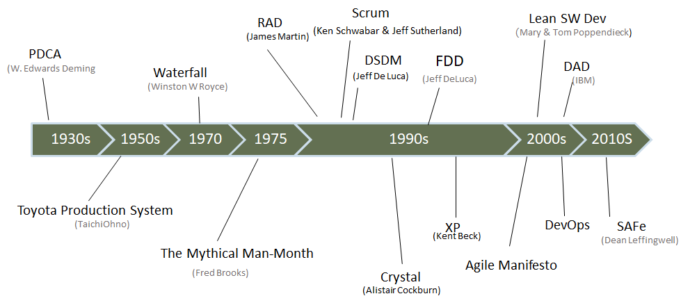

# 敏捷宣言和原则

2001 年，一批专家在对一系列轻量级软件开发中广泛使用的方法进行讨论后，同意将一些具有共性的价值观和原则汇集成敏捷软件开发宣言，或称为敏捷宣言[Agilemanifesto]。敏捷宣言包含以下四条价值观：

- 个体和互动*高于*流程和工具

- 工作的软件*高于*详尽的文档

- 客户合作*高于*合同谈判

- 响应变化*高于*遵循计划

敏捷宣言认为，尽管右项是有价值的，但是更重视左项的价值。

**个体和互动**

敏捷开发是以人为中心的。由人组成的团队构建软件，通过持续的沟通和互动，而不是依赖流程和工具，来达到团队的高效工作。

**工作的软件**

从客户角度来说，工作的软件比详细的文档更有用和有价值，它向开发团队提供了快速反馈的机会。另外，由于在开发生命周期的早期就有可工作的软件。虽然减少了功能性，但是敏捷开发可以带来巨大的上市时间优势。因此，敏捷开发特别适用于商业环境快速变化的情况，此时问题和/或解决方案还不清晰，或者适用于在新问题领域相关的业务创新。

**客户合作**

客户经常发现明确提出对系统的需求是非常困难的。客户与开发团队的直接合作提高了理解客户需求的可能性。虽然与客户签订合同是重要的，但是与客户定期和紧密的合作可能让项目更容易成功。

**响应变化**

软件项目中的变化不可避免。商业运营、法规、竞争对手的活动、技术进步以及其他因素都会极大影响项目及其目标。开发过程必须适应这些因素。因此，在工作实践中灵活的拥抱变化比简单的遵循计划更重要。

**原则**

敏捷宣言的核心价值包含以下 12 条原则：

- 我们最重要的目标，是通过持续不断地及早交付有价值的软件使客户满意。

-  欣然面对需求变化，即使在开发后期也一样。为了客户的竞争优势，敏捷过程掌控变化。

- 经常地交付可工作的软件，相隔几星期或一两个月，倾向于采取较短的周期。

- 业务人员和开发人员必须相互合作，项目中的每一天都不例外。

- 激发个体的斗志，以他们为核心搭建项目。提供所需的环境和支援，辅以信任，从而达成目标。

- 不论团队内外，传递信息效果最好效率也最高的方式是面对面的交谈。

- 可工作的软件是进度的首要度量标准。

- 敏捷过程倡导可持续开发。责任人、开发人员和用户要能够共同维持其步调稳定延续。

- 坚持不懈地追求技术卓越和良好设计，敏捷能力由此增强。

- 以简洁为本，它是极力减少不必要工作量的艺术。

-  最好的架构、需求和设计出自自组织团队。

- 团队定期地反思如何能提高成效，并依此调整自身的举止表现。

# 敏捷的历史

在2001年，17位自称“有组织的无政府主义者”在Utah的Snowbird会面，分享他们的想法。Sutherland  和其它scrum的先驱也在其中。参与者们分享了互相竞争的几种方式：极限编程（XP）；透明化；自适应软件开发（ASD）；特征驱动开发（FDD）；动态系统开发方法（DSDM）。所有这些方式都是“轻量版”的框架，因为这些方法使用更少，更简单的规则来适应快速变化的环境。  不少与会者都觉得“轻量”这个术语挺适用的。

虽然与会者不能在方法上达成一致，但是他们还是为这个运动取了个名字：敏捷。这个词是一位参与者提出的，他当时正在读《敏捷竞争者和虚拟组织：给客户更多的策略》一书。书中列举了100家公司的例子——包括ABB，  联邦快递，波音，博士和哈雷戴维森，这些公司正在创建适应动荡市场的新方法。有了这个名字，参与者达成一致，发布了“敏捷软件开发宣言”，该宣言中突出了每个人都同意的4个关键价值。稍后在会议中，以及之后的几个月中，他们发展了12个操作原则，被称为“敏捷宣言背后原则”。  从2011年开始，所有的开发框架，以及与之匹配的价值观和原则就被称作为敏捷技术。

当Snowbird会议将敏捷创新推崇为信条之后，敏捷运动快速传播。签约人将文件上传到网上并邀请支持者在上面签名。原有团队的大多数成员，在这一年的后半年又重聚在一起讨论如何传播敏捷原则。所有人都同意对这个话题进行宣讲。  一些参与者想要形成永久性的工作小组； 所以他们成立了非营利组织“敏捷联盟”来支持该项运动。

> 敏捷的历史：https://www.jianshu.com/p/fe5f1eb125c4
>

> The Secret History of Agile Innovation: https://hbr.org/2016/04/the-secret-history-of-agile-innovation
> 敏捷十年简史回顾: https://www.csdn.net/article/2010-09-14/279410

敏捷宣言的诞生不是一撮而就的，而是经过漫长的时间的积累和发展，最终形成的。上图包括了其中一些重要的节点。

敏捷的出现原因是复杂的。以下几个方面都对敏捷的诞生产生了重要的影响：

1. **软件的发展**

   在二十世纪初的时候，整个软件行业还没有开始，当时主要是各种传统的制造业，例如：汽车。还停留在和硬件关联比较大的产业上。随着计算机的出现，软件行业快速的崛起，虽然传统的制造业仍然存在，但是很多在传统的制造业上的方法已经不太能适合软件发展的需要。尤其是随着计算机在各个行业的普及，以及个人电脑的兴起，对于新的软件开发方法的需求在日益增长。

2. **从业人员的变化**

   在传统的制造业中，主要的从业者是产业工人，工人们主要的任务是按部就班的在流水线上按照流程把自己的本职工作完成。但是在软件行业中，一方面对于软件开发人员的素质要求要比传统流水线要高，软件本身不是单纯的靠流水线的方式就能够开发出来的；另一方面，从业人员素质的提高，导致从业人员对自身发展的要求也在提高，他们不愿意像流水线工人一样，从事枯燥的重复性的工作，他们需要能够释放自己的创造力，更大限度的发挥自己的能力。所以大家看到敏捷中，很多都是强调个人能力和主观能动性。传统的复杂的流程束缚了很多有创造力的开发人员，影响了软件的进步。

3. **客户日益增长的软件需求**

   随着软件的用户从大型机构扩展到小型的组织和个人，软件客户的主体发生了很大的变化，用户对于交付的软件无论是从周期和质量上都提出了新的需求。同时软件客户从被动的使用开发出来的软件，转换到根据自己的需求来定制或者影响软件的开发。传统的类似于瀑布模型的开发方式，在很多场景下无法满足这样的要求。

## 什么是敏捷测试

敏捷是一个过程，不是一个事件。他是一个持续的应用原则、模式以及实践，来改进软件的结构和可读性的过程。它致力于保持系统设计在任何时间都尽可能的简单、干净以及富有表现力。

敏捷开发：敏捷开发是一种面临迅速变化的需求开始开发软件的能力。为了获取这种敏捷性，我们需要使用一些可以提供必要的纪律和反馈的时间。我们需要使用一些保存我们的软件灵活、可维护的设计原则，并且我们需要知道一些已经被证明针对特定的问题可以平衡这些原则的设计模式。

敏捷测试：是遵循敏捷宣言的一种测试实践。从用户角度持续迭代地测试新开发的功能；持续的响应用户的频繁反馈，不断修正质量指标，确认有效需求和用户反馈能得以有效实现，确保敏捷开发过程的质量控制和效率保证，及时发布软件产品。

测试敏捷化 是指在软件生命周期所有交付品质相关的活动中，通过对组织、文化、流程、技术等要素进行优化与改进，使得测试能够贯穿于研发全过程并与上下游团队高效协作，能够在业务与技术水平上持续提升，达到自我驱动、灵活赋能，快速交付、高效稳定的最终目标。

## 敏捷测试的起源

在谈敏测试的起源前，先谈下测试的发展过程。软件测试是伴随软件而生，从最初的以调试为特征的测试，到以工程化、智能化为特征的测试，再到以中心化为特征的测试，测试越来越规范、系统和专业化。把测试组织向“中心化”、“集中化”、“专业化”推进。

随着互联网技术快速发展，对研发团队提出了更高要求，需要运用移动互 联网、大数据、云计算等新型IT技术来帮助IT组织进行更加高效和稳定的 管理和创新，在进一步提升效率同时管控好风险。相应地软件测试也要更 快地适应这种要求。测试人员更聚焦于有价值的可交付物，更聚焦于价值 流动的瓶颈解决而非流程、文档等中间交付物。
- 由此组织形式发生了一些演变，小而美的团队形式大行其道。紧凑而自组织型团队可以快速地响应外部需求和变化。测试人员融入研发团队以项目为单位进行产品迭代。测试角色除了测试工作外，还有了测试开发、质量分析等更高的职责要求。

- 对测试人员赋能要求的提升，随着需求到开发节点实现高效衔接后，测试、运维渐渐成为项目瓶颈。同时项目交付节奏越来越快，从需求到交付过程充满了各种变化。竖井式管理模式，制约团队间的测试协作，自组织项目型团队需要各角色高效地运转以有效响应快速的业务交付。要求测试人员具备更好的研发及工程能力，向团队提供智能高效的执行、管理、度量质量工具。这样敏捷测试就应运而生了。

## 敏捷测试的特点

测试敏捷化是覆盖全生命周期的质量改进，最终实现达到自我驱动、灵活赋能，快速交付、高效稳定的最终目标。表现为：
- 激发软件交付和运维团队成员的测试主观能动性。

- 在软件生命周期各个环节，快速反馈软件质量，加速价值交付。

- 持续改进各种测试实践，提升测试效率。

- 与需求、开发和运维等工作相互促进，使得测试成为驱动交付质量与效率持续提升的最主要力量之一。

敏捷测试的价值：

1）拓宽测试视野。敏捷测试关注点在测试环节。提出测试敏捷化，关注范围不仅仅是测试工作，更加注重开发、测试之间的敏捷一体化达成。思考和工作视野从单一测试环节中跳出来可以看到端到端的价值交付。

2）前瞻性体现测试价值。DevOps在国内快速发展带来一个副产品，即测试价值得到凸显。多变且繁多的需求、快速且敏捷的开发直接将业务压力推向测试，测试成为整条价值交付链中效率瓶颈以及由于测试缺失或不完整带来的质量瓶颈。此时，IT组织意识到测试对软件产品在质量和效率管控方面的重要性。测试敏捷化提出本质是跳出被动测试思维，更加关注测试真正的价值。测试不仅是完成被分配的测试任务，而更应该看到测试可以作为独立主体为研发一体化赋能，以此实践和推动IT组织的敏捷化。

3）指明测试未来的发展方向。测试由手工发展至自动化，下一步应该如何走？走向哪里？一直是测试在不断思考的问题。从手工测试发展到自动化测试只是在工具层面做了优选，并没有解决测试未来发展的方向问题。测试敏捷化在愿景、组织、管理等方面为测试提供了发展新思路：测试敏捷化，即未来测试应考虑如何独立地构建自身能力，以赋能为手段对外部输出，提供安全、稳定的质量和效率服务。

# 敏捷测试的发展

敏捷测试在目前的发展中面临的几个问题：

1）敏捷测试需平衡测试效率与安全、质量与稳定的关系。

   敏捷测试是在新形势下面临着各种挑战的情况下，应运而生的。敏态的IT组织更强调效率，但是相对稳态IT来说，在强调效率的同时对质量的要求就没有稳态更注重质量。近年来，在双态IT发展推动下，敏态组织从开始就构建了敏态应用开发体系，敏捷测试本身就作为一个快速验证的手段，持续反馈问题。随着IT组织的逐步成熟壮大，在现有的效率至上也基于质量去平衡考虑安全和稳定的效果。这样就兼顾了效率和稳定。

2）敏捷测试构建何种能力来衔接到持续交付过程中。

   在目前持续交付的链条中，持续测试能力将成为影响整体效能关键的节点，也越来越显性的成为持续交付中的瓶颈。业务需求在变，开发过程越来越敏捷，测试应构建何种能力来衔接需求、开发到运维的持续交付过程呢，这也是敏捷测试需要持续发展和改进的一个问题。

3）建立怎样的敏捷管理流程，来应对快速多变的需求。

  敏捷测试的流程，如何才能保证测试效率和满足体系管控的矛盾。对传统的测试流程要遵循流程管控、对测试进行整体规划、管理、执行和反馈。但对于敏捷测试而言如果仍然需要沿用这种规范和强调文档审批的流程模式的话，将无法适应外部的需求快速灵活的变化。所以敏捷测试流程在这方面需要考虑建立一个什么样的管控模式开适应快速多变的需求带来的测试敏捷化要求。

4）高效的敏捷测试壁垒。

  敏捷测试离不开敏捷组织支持以及因敏捷形成的新文化氛围。各种角色需求、开发、测试和运维在尽可能近的空间里，通过面对面交流来消除沟通时间上的浪费。这样对测试人员的技能就要求越来越高。

针对以上面临的这些敏捷测试发展中的问题，敏捷测试的发展需要针对这些问题进行以下持续改进，适应各种需要才是敏捷的发展之路。

1）积极推进人员培养和团队敏捷化转型。测试敏捷化转型需要提供和培养更多具有敏捷化测试价值观和技能的的人员加入项目研发中。

2）引入敏捷文化。新事物推行是否成功，除了组织结构调整之外，与组织的文化也息息相关。从目标构建、协调支付、知识共享、平等创新等方面来提出测试敏捷文化。

- 目标构建：在以“快速实现业务价值”共同目标下，测试不仅是测试人员的事，开发团队职能范围不在是简单编写代码，而是围绕交付物这一目标开展的质量活动，包括单元测试、接口测试、持续集成等，保证产出物的可交付。
- 协同交付：讲究团队之间协作，鼓励员工跨部门合作，在工作中发挥自己的专长和创意，通过协同工作提升和保证交付的高效和可靠。
- 知识共享：推行主动学习和知识共享。采用培训、咨询方法学习新知识。每个团队成员明确工作内容，采用什么技术及业务，工作成果对其他成员的影响，了解团队内其他成员的工作内容。
- 平等创新：推行创新、强调平等，在流程可控的条件下，支持各种创新手段和技术提供测试效能。
      

3）流程左移、右移以适应测试敏捷化要求。随着应用技术的发展，软件生命周期也在发生变化，不论哪种生命周期都可以分为三大阶段：软件定义、软件开发、运行维护。其中软件测试全线贯通三个阶段，通过左移、右移，实现测试在软件工程全生命周期的参与，强化测试的速度和适应性，从而做的持续快速的测试和质量反馈。

4）技术随需而用。随着技术的发展，各种测试技术也日渐成熟，自动化测试、代码静态扫描等技术和工具的应用质量测试敏捷化的实施，提升了测试效能。这些应用技术和工具层出不穷，但技术和工具应用本身不区分敏捷与否，只是适用的场景不同。

  5）改善度量评估，测试敏捷化是一个推动力，良好的度量评估标准有益于持续改进。

>   Form 《双态IT联盟-测试敏捷化白皮书》
>