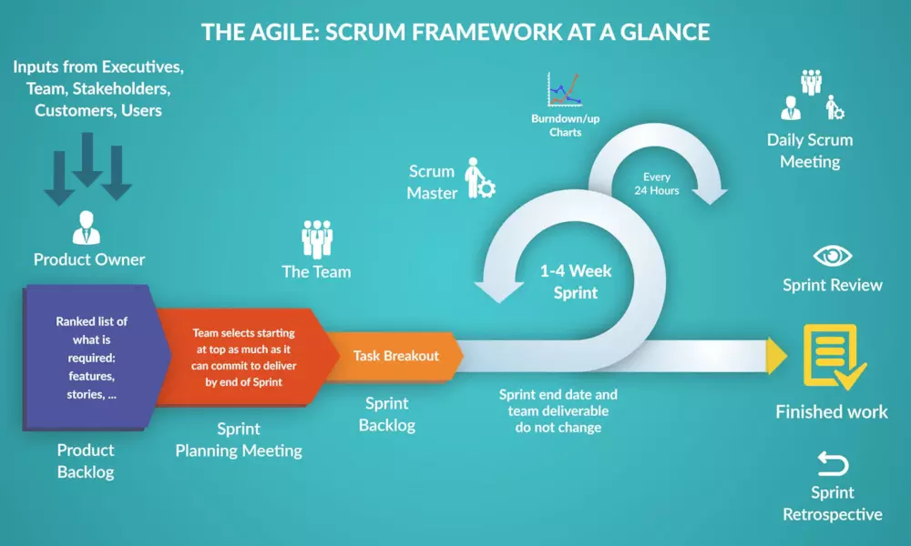

## 什么是Scrum

​	Scrum 是用于开发、交付和持续支持复杂产品的一个框架，是一个增量的、迭代的开发过程。在这个框架中，整个开发过程由若干个短的迭代周期组成，一个短的迭代周期称为一个Sprint，每个Sprint的建议长度是一至四周。在Scrum中，使用产品Backlog来管理产品的需求，产品backlog是一个按照商业价值排序的需求列表，列表条目的体现形式通常为用户故事。Scrum团队总是先开发对客户具有较高价值的需求。在Sprint中，Scrum团队从产品Backlog中挑选最高优先级的需求进行开发。挑选的需求在Sprint计划会议上经过讨论、分析和估算得到相应的任务列表，我们称它为Sprint backlog。在每个迭代结束时，Scrum团队将递交潜在可交付的产品增量。 Scrum起源于软件开发项目，但它适用于任何复杂的或是创新性的项目。Scrum 目前已被用于开发软件、硬件、嵌入式软件、交互功能网络、自动驾驶、学校、政府、市场、管理组织运营，以及几乎我们（作为个体和群体）日常生活中所使用的一切。（源自Scrum中文网）

​	Scrum基于经验型流程控制理论，其整体框架流程图如图2-1所示。

图2-1 scrum流程示意图（图片来源于网络）

