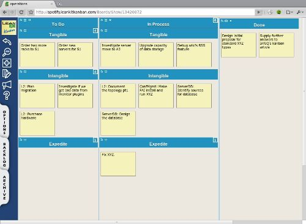
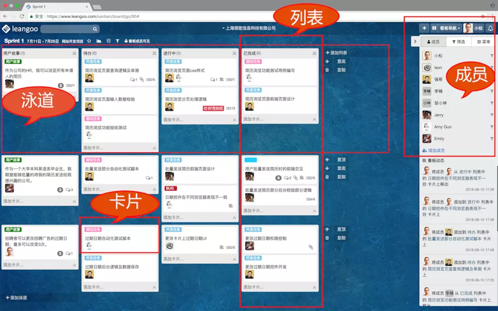
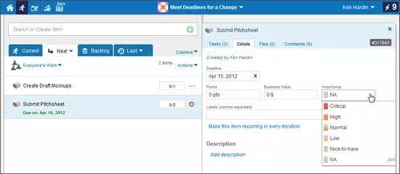
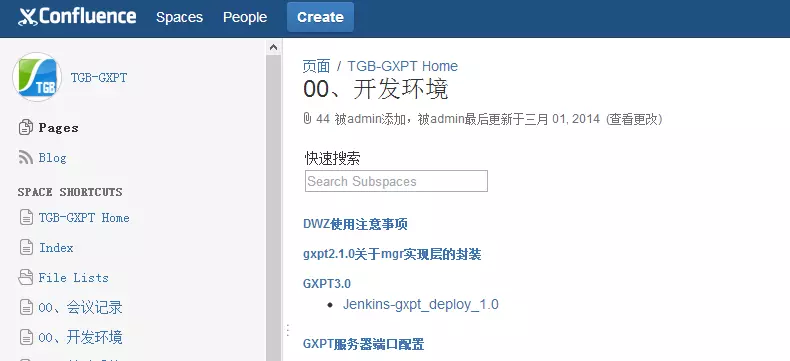

## Scrum敏捷开发工具

做敏捷开发，如何敏捷？我们需要一系列成熟的工具帮助我们敏捷。敏捷开发工具的适合以及选用，对开发项目起着关键性的作用。

下面介绍几款在scrum敏捷开发中常用的工具，方便更多新加入的开发者上手。

1. **AxosoftOnTime Scrum**

AxosoftOnTime Scrum能够帮助开发团队管理待办事项、产品发布和模拟项目冲刺。这款基于HTML5特性的工具提供创建图表和管理仪表板的功能，随着工作时间的走动，它可以追踪代码特性并修复bug。除此之外，HTML5也是AxosoftOnTime Scrum平台的一部分，兼具一些其它有用的协作工具，例如Wiki和bug追踪器。

2. **LeanKit**

LeanKit使用一个基于云的whiteboard来规划组织过程。每个卡代表一个工作项目，并提供状态更新选项。使用LeanKit的团队可以看见工作负载分配并导出历史数据。

3. **Leangoo**

Leangoo是一款永久免费、简洁、轻量、高可视化的敏捷团队协作工具。由国内最权威的[Scrum中文网](http://www.scrumcn.com)精心打造，融入了先进的敏捷管理思想。它的核心是看板，通过看板共享和实时同步团队工作以实现高效协同, 团队工作体现为卡片，内容可以是需求、任务、问题等。

Leangoo看板上的主要元素包括列表和泳道，列表管理工作的不同阶段或状态，泳道实现任务的分组对应，从两个纬度让团队的工作 高度可视化、一目了然。

Leangoo可以帮助我们管理事务，需求管理，迭代管理，缺陷管理，测试管理，排列优先级等，随时随地可以了解到团队以及项目的进展情况。

它的**思维导图**功能也非常强大，可以多人协作，多人在线编辑，实时同步，实时共享。也引用至看板上

更有强大的统计功能：看板统计（燃尽图、任务分布、任务周期）。项目统计（项目进度、团队速度、缺陷分布）。企业级统计（项目状态、需求趋势、缺陷趋势、吞吐量）。

4. **Planbox**

Planbox通过burndown图表来跟踪监视项目的进程，同时结合客户的反馈信息，这项工具所针对的人员是相对较广泛的。

5. **confluence**

进行敏捷开发怎么能少了Confluence，它是一个专业的wiki程序。它是一个知识管理的工具，通过它可以实现团队成员之间的协作和知识共享。想想维基百科，你就知道confluence的便利之处。

6. **jira**

JIRA是项目与事务跟踪工具，被广泛应用于缺陷跟踪、客户服务、需求收集、流程审批、任务跟踪、项目跟踪和敏捷管理等工作领域。

本文参考自：https://www.jianshu.com/p/f54ddddf8c4c
