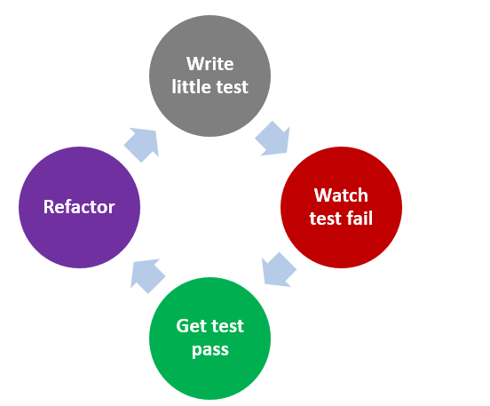
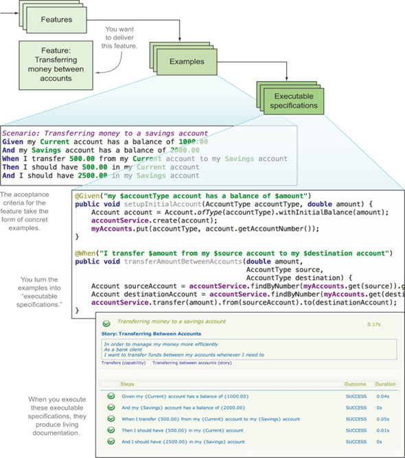

# 测试驱动开发、验收测试驱动开发和行为驱动开发

敏捷中出现各种”XX驱动开发“的实践。起源主要是来自Kent在极限编程中提出的测试优先编程（Test-First Programming）。现在出现了（除了行为驱动开发以为，相关的还有像实例驱动开发（EDD-Example Driven Development），特性驱动开发（FDD-Feature Driven Development）等。

各种驱动开发之间的关系众说纷纭这里我们来聊一聊测试驱动开发（TDD）、验收测试驱动开发（ATDD）和行为驱动开发（BDD）。

## 测试驱动开发

[Kent Beck](https://baike.baidu.com/item/Kent Beck)最早在其极限编程（XP）方法论中，向大家推荐“测试驱动”这一最佳实践，还专门撰写了《测试驱动开发》一书，详细说明如何实现。

**测试驱动开发（TDD）使用自动化测试用例来指导开发代码。**TDD 过程包含下列活动：

- 新增一个测试（成生测试用例并自动化），用于描述在代码内的某一小片段所期望的功能（程序设计的思路）；
- 此时因为相应的业务代码还没有编写，测试无法通过；
- 编写业务代码并运行测试直到测试通过；
- 在测试通过后，如果代码又有变更，例如对业务代码进行重构，则需再次运行测试以确保变更后的代码仍然可以通过测试；
- 对代码内的下一小片段继续执行上述过程，需要运行之前的测试（回归测试）以及新加入的测试。

  

> 行为驱动开发和测试驱动开发介绍: https://www.itsource.cn/web/news/1933.html

虽然“测试驱动开发”里面有测试的字眼，但是这个其实还是个开发活动，通常都不是由测试人员负责的，即使其中的驱动开发的测试的代码也不是测试人员编写的，至于里面涉及到的代码的重构这些内容，就更是开发人员而不是测试人员编写的。

**狭义的测试驱动开发一般指的就是单元测试级别的测试驱动开发。但是广义的测试驱动开发不仅仅可以用于单元测试级别，还可以用于集成测试或者系统测试级别。当然也可以用于验收测试级别，**此时就是后面要讲的验收测试驱动开发。

敏捷中很多思想都是建立在个人或者团队能力成熟度很高的基础上的。很多团队在实施测试驱动开发的时候无法顺利的进行下去，有很大一方面是实施的团队的技能还没有跟上。你很难想象一个开发团队，在单元测试都无法高质量的完成的情况下，转型采用TDD能够成功。

## 验收测试驱动开发

验收测试驱动开发（ATDD），在用户故事的创建阶段就定义验收准则及其相关的测试。ATDD 强调协作，各个利益相关者（开发、测试、业务代表等）不仅要理解软件组件应该有何种行为，还要理解如何做才能确保可以通过验收。 

**验收测试驱动开发是一种测试优先的方法。**

首先需要再实施用户故事之前创建测试用例。测试用例由包括开发人员、测试人员和业务代表在内的敏捷团队创建，可以是手工测试用例也可以是自动化测试用例。第一步是开展一个由开发人员、测试人员和业务代表一起参与分析、讨论和撰写的规格说明研讨会。任何在用户故事中不完整、不清楚或者错误的地方都会在这个过程中得到修复。

下一步是创建测试。这一活动可以由团队一起完成或者由测试人员单独完成。在任何情况下，测试都应该由一个独立的个人（如业务代表）来确认。这里的测试是描述用户故事中特性的例子。这些例子会帮助团队正确地实施用户故事。由于例子和测试是相同的，二者经常可以互换使用。这项工作从基本的例子和开放的问题开始。

一般而言第一次测试都是正向测试，在没有意外或错误条件下确认正确的行为，比较执行的活动的顺序，判断是否如期望的那样进行。在正向路径测试完成后，团队应该撰写逆向测试并且覆盖非功能属性（如性能，易用性）。测试须以利益相关者都能理解的方式表述，包含以自然语言表达的语句，这些语句应该包括必要的前提条件以及任何可能的输入和相关输出。

例子必须覆盖所有用户故事的特性，并且不应该添加新内容到用户故事中。这意味，不应存在那些描述没有被写在用户故事中的例子。另外，不应该有两个例子描述用户故事中的相同特性。

## 行为驱动开发

行为驱动开发（BDD）使开发人员聚焦于测试软件行为是否符合预期。由于测试是以软件行为的形式展示出来的，测试对于团队成员和其他利益相关者来说更容易。单从BDD的概念来说，它不仅仅是针对测试，它使得在业务团队和开发之间达成共识。在软件项目中涉及多人紧密协作，由产品业务讲解功能需求，开发负责代码实现，测试保证软件质量，高质量的沟通对项目成功至关重要。如果在一个项目中业务人员用自己行话，开发人员用技术语言、技术思维去理解业务，在沟通过程难免出现分歧，开发人员就可能按自己的理解去实现了一个错误的功能。

BDD用通用自然语言描述实例（系统行为）。团队成员使用统一、易读的语言明确实例，作为验收测试标准。一方面可以消除理解上的歧义，一方面可以激发思考没有考虑到的场景。这里的实例是可以随时运行，反馈系统运行真实结果，如果运行失败，要么文档过时需要更新，要么系统出现问题需要修复。

在讨论BDD和TDD、ATDD的关系时，**有些地方把BDD看成一个新的完整的开发流程，也有些地方把BDD看成是TDD的延伸，ATDD的一种落地的实例。**这只是从不同的角度来看待BDD，并不影响BDD的本质。

典型的 BDD 框架将验收准则用 given/when/then 的格式表示：

*Given*（给定）某些初始上下文，

*When*（当）一个事件发生， 

*Then*（则）确保某些输出。

> 行为驱动开发，让开发做正确的事: https://yq.aliyun.com/articles/594347
>
> 行为驱动开发（BDD） - 一个快速的描述和示例： https://www.cnblogs.com/Javi/p/7158573.html
>
> 五分钟让你彻底了解TDD、ATDD、BDD&RBE：https://mp.weixin.qq.com/s/KCrkL4NeuZeZvTu5Sc6B_g

## 小结

TDD、ATDD和BDD通过在开发之前清晰的描述系统行为和开发详细的测试用例来帮助开发人员更好的开发出高质量的代码。 测试从以前的破坏性的方法转换到建设性的方法中来。 给整个开发带来的新的思想上的变化。但是这些新的思想在实践过程中的具体能够带来多大的好处，也受到使用的组织和人的各方面条件的限制。没有一劳永逸的技术，只有持续不断的改进。这才是敏捷思想的内涵。
