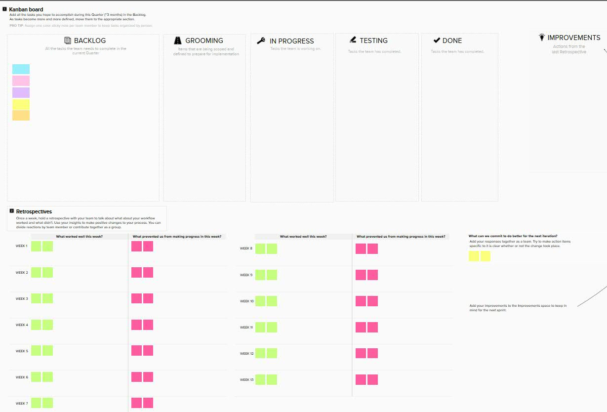

# 看板

看板方法，一般认为是由大卫安德森（David J. Anderson)发明创造的，于2004年诞生在微软的XIT项目，并于06年至07年之间在Corbis公司得到大规模运用，紧接着在全球迅速推广。

大卫在发明看板方法之初，便深受了大野耐一的丰田生产方法（TPS），高德拉特的约束理论（TOC），戴明的质量管理，以及敏捷开发的影响。因此，看板方法中的很多概念，都可以从上述理论中找到影子。看板在敏捷项目中被广泛的使用。

> 深入解读主流的敏捷方法之一“看板方法” https://www.rishiqing.com/web/solution/%E7%9C%8B%E6%9D%BF.html

很多敏捷团队在使用看板的过程中，主要利用了看板的可视化这个特点。当然，这个特点对敏捷团队的帮助很大。其实看板其实作为一种系统的方法，还有更多的用途。

看板主要目的是在一个供应链内构建可视化的工作流并优化。不同的地方对看板的特性描述各有不同，这里面我们介绍其中的三个比较常见的特：

- 看板图：需要管理的供应链通过看板图来达到可视化。每一列显示了一个工位，它由一系列相关的活动组成，比如开发或测试。将要产出的项或需要处理的任务用标签加以标示，在看板上从左到右移动的通过各工位。
- 进行中的工作数限制：严格限制并行处理的任务数量。控制每个工位以及/或整个看板图的最大可允许标签数。一旦某个工位有空闲的工作容量，成员可以从前一道工序领取看板标签。
- 交货期（lead time，有些地方翻译成前置时间）：看板通过最小化价值流的平均交货期来优化连续的任务流。

## 看板图

看板图是大家在使用看板的过程中最常用到的一个特性。看板的可视化的特点非常好的帮助团队时刻掌握项目的总体情况。下面就是一个github中自带的电子看板图。


上面这个是比较简单的看板，只包括了三列“to do”、“in progress”和“Done”。在常见的物理看板中，使用的比较多的都是相对比较简单的看板图，否则在一块物理看板上管理太多的工序和工作会过于复杂。这里说的物理看板，指的是用一块白板或者是办公室中的玻璃墙构建的看板，每天工作的时候一抬头就可以看到的。

相对于物理上的看板图，电子看板的内容和形式可以更丰富一下。下面是一个电子看板图的例子。



能够采用看板进行管理的工作项很多，以下是一些典型的工作项类型：

- 需求
- 功能特性
- 用户故事
- 用例
- 变更请求
- 产品缺陷
- 改进建议


## 进行中的工作数限制

对进行中的工作数（work in progress，缩写为WIP，有些地方也翻译为在制品）限额，通过强制让团队聚焦在更小的一套任务中来改善吞吐量和减少“将要完成”的工作量。从根本上来讲，WIP限制鼓励的是“完成”的文化。更重要的是，WIP限制可以让阻碍和瓶颈显而易见。当有明确指示现有工作遇到瓶颈时，团队可以聚焦在阻塞问题上尽快的理解、实施和解决。一旦消除阻塞，团队中的工作将再次开始流动。这些优势可以确保在最短的时间内向用户交付有价值的增量，从而使得WIP限制成为敏捷开发中一个非常有价值的工具。

> 敏捷开发：看板中的WIP限制思想： https://www.jianshu.com/p/3e2ccd0e58cc

1. 限制整块看板在制品总量


限制正在进行的总的工作项的数量，当工作项数量达到上限时，只能有工作项完成之后，才能开始新的工作项。工作的重心是聚焦在完成，而不是在开始。

为了使工作项更快的完成，在制品的限制应该如何设置呢？在制品限制越低越好，这样可以加快在制品的流动。但是并不是团队人数x1就能达到最好的效果。如果最大限制为团队人数x1，那么一旦有一个成员的工作受到阻碍，比如需要等待客户的反馈，这个成员就只有闲置等待。那么如果把在制品限制设置为团队人数x2，这样即使所有成员的当前工作受到阻碍，他们都可以开始新的工作，不会出现人员闲置的情况。但这样的设置不利于促使大家去有效的解决障碍。

在实践中，团队可以先设置一个大的值，比如团队人数x2，然后在工作的进行中，让这个数值不断递减，找到一个适合团队的限制。在制品限制递减的过程，也是团队持续改进的过程。

2. 限制某一个状态（某一列）的在制品数量

如果某一列的工作项数量已经达到了上限，则上一个状态的工作项是不允许移动到这个状态来，直到这个状态的工作项有了进展，移到了下一个状态，才允许上一个状态的工作项移过来。当某一个状态遇到了瓶颈，积累了最大限度的工作量，这种方式可以迫使我们去想办法解决这个瓶颈问题，从而打破僵局。这种方式有利于发现瓶颈，消除瓶颈。

3. 限制每个成员的在制品数量

对每个成员设置最大工作项的限制，这样有利于协调人员过闲或人员过忙的情况。

> 浅谈《看板实战》，https://www.jianshu.com/p/080da84b2904

需要和价值流上下游的干系人对进行中的工作数（work in progress，缩写为WIP）限额达成一致。所有的WIP限额都可以通过不断的试验进行调整。实施看板是一个实验性的过程。不要浪费时间试图确定完美的WIP限额大小；只需要先设置一个差不多大小的限额，往前走，必要时对限额进行调整、观察和再调整。

工作流下游的一些区域不设置WIP限额，有时也是可行的。要特别注意、不设WIP限额的工序不应该是可能成为瓶颈的工序。一旦建立了WIP限额，那么就应该根据工作类型来分配产能。


## 交货期

交货期英文对应的是Lead Time，这里翻译成交货期，也有翻译成前置时间、交货时间等。

根据看板管理的工作项的不同，这里的交货期具体的意义会有所不同。例如：可以是某个需求、用户故事或用例等从开始到最后发布需要持续的时间，也可以是某个缺陷从被发现一直到最后被解决并关闭的时间。

说到交货期和在制品数量的话，就不能不说到利特尔法则（Little’s Law）。利特尔法则（Little’s Law）作为一个非常朴素的原理，为看板方法奠定了一个理论基础，看似简单的公式背后却有其复杂的一面。

利特尔法则的公式是这样的：

```
平均吞吐率=在制品数量/平均前置时间
```

举个例子，假设你正在排队买快餐，在你前面有19个人在排队，你是第20个，已知收银窗口每分钟能处理一个人的点餐需求，求解你的等待时间。

如果你已经决定要排队，并且站到了队尾，那么在制品数量就是20（个），平均吞吐率是1（人/分钟）。
 从你站到队尾的时候开始，一直到你点完餐，这个时间就是你的“前置时间”。
 即使我们没有学习过利特尔法则，也可以轻易地算出来：

```
    1 = 20 / x
    x = 20（分钟）
```

因为在一段时间之内，保持工作量饱满的话，我们每天能做多少工作基本是一定的，所以吞吐率基本上不会发生太大变化。
如果这个时候我们想缩短平均前置时间，也就是等待的时间，利特尔法则告诉我们：可以通过减少在制品数量来达成这个目标。
 在这个例子中，就是减少排队者的数量。

这也很好理解，10个人的队列和20个人的队列，前者需要等待的时间会更短。

> 看板和利特尔法则： http://insights.thoughtworkers.org/kanban-and-little-law/


## 小结
上面简单介绍了一下看板常见的概念。看板的使用看起来简单，其实是一个系统工程。需要大家在深入了解看板原理后，不断的实践中不断的调整和改进才能够真正发挥它的功效。
