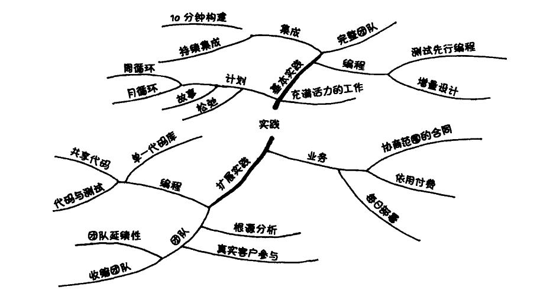
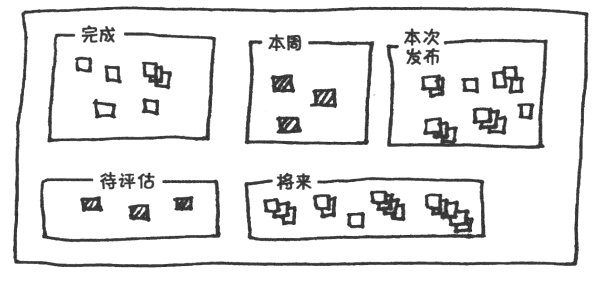

# XP（Extreme Programming）的由来

本部分关于XP的主要的内容参考的是Kent在2004年写的《解析极限编程-拥抱变化》，如果对比他在1999年出版的第一个 版本的话，你会发现其中无论是价值观、原则和实践都发生了一些变化，当然这个恰恰体现了敏捷的拥抱变化。

XP中提到的价值观和各种原则很多都是思想层面和面对事物我们应该如何思考，他们不仅仅可以用在软件开发中，也可以用在我们生活的方方面面。

但是在了解XP的过程中一定不要生搬硬套，要牢记唯一不变的是变化。XP中的价值观、原则和实践是Kent在工作中不断总结和积累的，有些可能是适合自己团队的，有些不一定适合。学习XP的关键是在不断学习和实践中总结出适合自己团队的价值、原则和实践。

# XP的主要价值观

刚开始学习敏捷的时候，我最喜欢的是学习它的各种实践和工具，因为这些可以直接使用的东西让我觉得能以最快的方式明白并实施敏捷。但是随着我对敏捷的了解，我发现其实产生这些实践或工具的价值观反而是更重要的。因为这些价值观是实践或工具的源泉，是我们要追求的“本”。不同的团队在实施过程中可以使用不同的实践，关键是要和最原始的我们追求的价值相符合。我们可能经常听到说“我们是按照XP来开发的，XP中要求我们应该如何如何“。这种说法其实是有待商榷的。XP中的各种实践其是来自于价值观，这些实践是可以不断变化和进化的，所以核心依然是团队应该有一个正确的价值观。

XP的五个价值观：

1. 沟通（Communication）

   > 每当你遇到一个问题，首先问自己这个问题是不是由于缺乏沟通引起的，你需要什么样的沟通来解决该问题？需要什么样的沟通来使你以后避免这样的麻烦。

   重视沟通，并不是说我写一个一千页的文档就是重视沟通。如果每天15分钟的交流更有效的话，那么为什么还要花那么多时间写文档呢。所以重视沟通，应该寻找最有效的沟通方式，而不是尽可能多的花时间在沟通上。

   敏捷非常重视沟通，像结对编程、站立会议、看板等其实都是和沟通直接相关的。

2. 简单（Simplicity）

   这里的简单其实是有前提的。

   > 什么是最简单而又可能有效的。

   简单的前提是要有效，不是一味的追求纯粹的简单。另外这里的简单要主要是针对当前的开发团队的简单，而不是针对这个世界的简单。这个世界有很多能力非凡的牛人，对他们来说很多事情很简单，但是在我们自己的开发团队中可能就不是那么简单。对于Kent Beck来说，针对自己的项目把JUnit稍微改一下以适应自己的项目可能是相对简单的，因为他是JUnit的作者之一，但是对于大部分的开发团队而言，这个可是非常困难的。

3. 反馈（Feedback）

   之所以需要反馈，其实是因为我们没有办法一次做到完美。反馈非常容易理解，就像我们现在画一些过程改进的流程一样，我们最喜欢看到的是一个“圈”，就是一个循环或者就是一个反馈。每次完成了一个事情之后，我们都需要不断地总结并提供反馈，使得下一次能够做的更好。

   反馈的周期最好能够短一点。如果我们做错了一件事情，我们希望能够马上就能知道错了，这样就可以很快改进，修改的成本也最低。以测试中最常见的缺陷为例。缺陷是对开发人员开发的软件的一种反馈，说明存在一些漏洞。那么从开发人员引入缺陷到这个缺陷被发现以及后面的修复和验证，整个反馈的周期希望能够越短越好。很多敏捷中的实践都是来自这个价值观。

4. 勇气（Courage）

   这个词出现在价值观中让我觉得很有意思。第一感觉是和我们平时的工作关联不大。这里的勇气可以是耐心、坚持、不断的探究等。但是Kent也提到，勇气需要和其他价值观放在一起，不能孤立存在，否则可能会出现一些问题。相对于"勇气"，我个人可能更喜欢用“激情”这个词。

5. 尊重（Respect）

   前面的几个价值观相针对的是个体的多一些。最后这个价值观“尊重”，我感觉更倾向于团队构建的，有了“尊重”才能保证整个团队能够敏捷。尤其是在敏捷团队中，很多牛人一起工作，每个人都有自己的特点，“尊重”可以保证大家更好的合作。

上面讲到的这五个价值观是XP中重点提到的五个，每个敏捷团队都可以根据自己团队的特点选择适合自己的价值观，并根据这些价值观来不断的调整自己的实践。就像“尊重”这个价值观，就是Kent在2004年的极限编程的第二版中新增加的，在1999年的第一版的时候没有这个价值观。

前面我们提到价值在某种程度上相对于实践来说更重要。但是如果只有价值的话，显然也是不行的。最终还是需要将这些价值体现在项目中，所以价值和后面讲到的原则和实践是相辅相成的。

# XP的原则

1. 人性化（Humanity）

   软件本身没有情感，但是参与软件开发的人是有情感的。所以在整个开发过程中，一定要考虑人性化。没有程序员能够每天八个小时持续高效的工作的，按照稳定的速率前进可能要比每天都打疲劳战更高效。敏捷中经常提到要构建自组织、自激励的团队。但是客观的讲，构建这样的团队对人的要求是很高的。每个人都是在寻求技能的提升和职业发展，只有当个人需求和团队目标完全一致的时候才是这种理想的状态，否则在不同时期每个人可能都要不同程度的有所妥协。在软件开发项目中，需要尽可能构建一个人性化的环境，以支持每个人都能最大程度的发挥他们的价值。

2. 经济学（Economics）

   看到这个原则，我的脑袋里蹦出一句话“成年人的世界没有对错,只有利益”。这句话说的肯定是绝对了，但是利益在现实世界中是很重要的维度。一个公司存在主要目的是什么？追求利益的最大化。经济学在软件开发项目中非常重要，但是又是经常被开发团队忽略的。因为作为一名技术人员，不自觉的就可能陷入一种技术思维，而不是经济思维。技术人员可能更喜欢讨论哪个技术方案更好，哪种工具更先进。但是在日常的讨论中，务必牢记，从经济上看问题是很重要的，要关注价值。

3. 互惠互利（Mutual Benefit）

   在工作中一定要争取双赢或者是多赢的局面，只有达到双赢的方法才是最容易被接受并实施的方法。很多事情看起来有道理，但是可能并不是互惠互利的。例如：项目中经常要求开发人员尽可能写完善的文档，但是这些文档本身对于开发人员自己来说可能没有什么用处，而是为了帮助测试人员指导测试设计或执行的。这种情况其实就不是一种双赢。在敏捷中，会提倡先测试再编码，还会有代码和即文档的说法，都是一种互利互惠的局面。

   所以在工作中，切忌不要一味的对他人提出要求来满足自己的需要，要极可能的挖掘出双赢的解决方案。

4. 自相似性（Self-Similarity）

   > 将一个解决方案的架构复制到在一个新的场景中，即使他们具有不同颗粒度

   同样的实践可以用在个人身上，也可以用在一个小组中，还可以用到整个项目团队。例如：持续集成的实践，可以是每个开发人员自己开发的模块上使用，也可以在团队的模块集成中使用，同样可以扩大到整个产品的系统上。当然这种复制不是绝对的，肯定也存在由于不适合而导致的无法复制的情况。
   
5. 改进（Improvement）

   > 在软件开发中，“完美”是个动词，而非形容词。完美的过程是不存在的，完美的设计是不存在的，完美的故事也是不存在的。但是你能使你的过程、设计和故事更加完美。

   持续改进需要融入XP，甚至是敏捷团队的血液中。“持续”和“改进”同样重要，因为“完美”是个动词。需要不断的改进和自我挑战，让软件变得越来越“完美”。

6. 多样性（Diversity）

   多样性非常好理解。在日常的工作中，我们希望团队的成员技能、个性是多样的，考虑的解决方案是多样的，看到事情的角度也是多样的。但是在实际的工作中要做到拥抱多样性其实不是那么容易。当我们准备招聘一个新的团队成员的时候，可能会不自觉的招募具有和自己类似特质的人；当讨论解决方案的时候，我们潜意识希望大家的想法和自己保持一致，对不同的意见保持排斥。这些都是在日常工作中需要时刻提醒自己的，多样性的重要性。

7. 反省（Reflection）

   > 好的团队并不只是进行他们的工作，他们会思考如何工作和为什么工作。他们会分析为什么成功或失败。

   反省更多的是一种思考。反省非常重要，但是在日常又是大家经常忽略的。团队经常是专注于各种开发任务，缺少思考的时间。反省的方式有很多，不一定是和项目团队一起，平时和朋友家人聊天，广泛的阅读非IT相关的书籍，都会有助于帮助我们思考如何工作和为什么工作。当然作为反省的结果，必然是有相关的行动与之配合的，否则就成为空想了。

8. 流

   “流”这个原则的提出还是非常有意义的。流的概念打破了传统的瀑布模型、V模型中的结构化和模块化的理念。XP的实践更倾向于各个活动是连续的流，而不是多个离散的阶段。让整个开发更顺畅，就像流水一样。

   按照流的原则，XP会使用频繁的小的增量进行持续集成。每日构建其实就是面向流的，当然为了保证软件功能时刻都能正常工作，每天可能需要多次构建。

   很多团队在进行各种不同级别（例如系统测试）的测试时都会有一个非常明确的入口准则，如果入口准则不满足，就不会进入下个阶段的测试。这种做法能够非常好的保证系统测试执行的效率，避免因为开发的版本质量太差而导致系统测试效率不高（可能使很多测试运行不了，或者缺陷太多导致频繁的版本升级影响测试的效率）。那么大家觉得这种实践符合“流”的原则吗？

9. 机遇（Opportunity）
   > 要学会把问题看做改变的机遇

   这个原则更多是关于面对问题时的态度。一个积极正面的态度对解决问题是非常有意义的。每个出现的问题都可能是一次机遇，可能是个人能力提高的机遇、产品质量提高的机遇、团队更好的合作的机遇等。

   > 当你开始时间XP，你肯定会遇到问题。极限的其中一个 意思就是有意识的选择将每个问题转化为机遇。

10. 冗余（Redundancy）

    > 虽然冗余可能是一种浪费，但是在去除一个有意义的冗余时需要非常小心。

    冗余听起来是个负面的词，我们不是应该尽量去除冗余吗？在开发过程中，其实各个不同的层面都可能存在冗余，而且这些冗余是有意义的。例如在很多业务持续性比较敏感的系统（银行、证券交易）架构层面，为了保证系统的可靠性，我们需要从设计上有冗余，避免任何单点故障就导致系统无法提供服务，任何时候都不能因为一个模块、硬件、链路出现问题就导致系统服务终端；在开发中，结对编程其实也是一种冗余的形式，有两个开发人员一起工作；在测试活动中，各种不同的测试之间可能也是存在冗余的，安全性、互操作性、性能、易用性、可靠性等测试之间也存在一定的冗余，甚至测试本身是不是就是一种冗余？

11. 失败（Failure）

    > 不知道实现一个故事的三种方法中哪种可行？那就尝试所有三种方法。及时它们都失败了，你肯定还是会学到一些有价值的东西。

    这个原则称为“失败”，其实本质的意思是不要惧怕失败和用于面对失败。谁都想成功，但是并不意味自总是能够成功。在通往成功的道路上，失败可以说是不可避免的。“失败乃成功之母”。

    有时候我们把很多实践花费在了没有结论的讨论上。如果把利用这些时间来尝试可能的想法，我们以及能够知道结果了。在开发过程中，一定要敢于尝试，不要怕失败，要大胆的试错。为了支持这个原则，就需要构建一个支持“失败”的团队氛围，不要因为试错的过程而批判开发人员，而是鼓励大家不断的尝试。如果失败了，积极的分析结果，积累经验。

12. 质量（Quality）

    > 通过牺牲质量来控制的手段是没有效率的。质量不是一个控制变量。项目不会因为接受低质量而加快进度，也不会因为要求更高质量而使进度减慢。

    在项目管理中提到成本、进度、质量和范围之间是个平衡。但是XP认为质量是不能牺牲的。如果是为了赶进度、降低成本而牺牲质量，最终结果可能是适得其反。

    > 如果你不能通过控制质量来控制项目，那你如何控制？时间和费用通常是固定的。XP选择了范围作为计划、跟踪项目的基本手段。范围是不可能预先精确制导的，因此它是一个好的杠杆。

    如果再考虑“人性化”的话，你会发现没有人愿意交付一个低质量的产品，也没有人愿意在一个不断交付低质量产品的团队中工作。

13. 婴儿步（Baby Steps）

    > 婴儿步的观点认为：相比于团队取消失败的、大的改变引起的浪费，多个小步前进的代价要小得多。

    获得“大”成就是每个团队和其中成员的自然的需要，但是每个“大”成就都是有很多“小”成就构成的。婴儿步并不是要放弃我们对大成就的追求，婴儿步也不意味着慢速度。婴儿步可以有效的避免突然出现重大的风险，也避免在错误的道路上走的太远。婴儿步这个原则在敏捷中有着广泛的应用，不管是每日构建、持续集成、持续交付都是体现了婴儿步原则。

14. 接受责任（Accepted Responsibility）

    > 如果有人试图给你责任，只有你自己能够决定是否负这个责任。

    这个是敏捷中非常强调的自组织的一个体现。任何责任并不是其他人指定给某个人的，而是团队成员自己要认可这个责任，这样才能真正的把事情做好。例如：最终干活的人需要参与前期的计划和估算以保证估算的合理性；负责软件设计的人最好也是接下来进行编码的人。

    责任和权利必须是对等的。当开发人员接受了相应的责任，就意味着他有与之对应的权利，这样才能最有的发挥团队。

# XP的实践

XP的实践分成两大类：基本实践和扩展实践。顾名思义，在没有掌握基本实践的前提下，实施扩展实践可能会比较困难。XP的每个实践都可以单独实施，但是如果多个实践共同实施的话，效果会更好。

实践是很多人认为的XP的干货。但是就像前面章节说到的，实践需要结合价值观，否则在实际操作中可能会偏离原来的初衷。实践是与环境有关的。如果环境改变了，就可能需要选择不同的实践。

## 基本实践

1. 坐在一起（Sit Together）

   这是个神奇的实践。如果没有对比的话，可能感受不到这个实践的巨大作用。如果你从工作开始一直都是和你的同事坐在一起，有很多公司还是用的一张很大的桌子，那么你一直就在实施一个非常好的实践。这个实践是针对有很多公司里面使用了不利于沟通的办公方式，例如：每个人独立的房间、有高高挡板的格子间或者很多人在家办公等。

   虽然坐在一起不是实施XP的前提，但是坐在一起对沟通的效率的提高是非常显著的。“坐在一起”意味着大家见面的时间更多，项目成员之间的关系更亲密，生产效率也更高。

2. 完整团队（Whole Team）

   > 将拥有项目成功所必须的各种技能和视角的人都包含进团队。

   完整团队的好处可以从两个方面来理解。第一个方面是能够完成项目的便利性，这里的完整团队是指能够独立完成某个交付的团队，这个团队中有从前端到数据库的技能的开发人员，也有必备的测试人员，能够确保特定的交付在这个团队内部就能完成；另外一个方面是从团队的责任感和成就感来考虑，在一个完整团队中，所有的责任都在团队内部，每个成员都会全力以赴于项目的成功，不会出现等待其他团队或者依赖其他团队的情况，所有团队成员可以拧成一股绳，彼此支持，互相帮助。

   在完整团队中，要尽量避免一个人同时出现在两个团队中。例如：有个成员，每周有2天在团队A工作，另外有3天在团队B工作，这样反而会降低工作效率。

3. 信息工作空间（Informative Workspace）

   很多团队都在利用看板或者墙面将各种信息展现在自己的工作空间。

   

   各种项目信息从逻辑上讲，无论是放在某个工具软件中，还是直接利用看板放在大家的工作场所，其实没有什么区别，毕竟内容都还是一样的。但是大家每天都能直观看到对人的心理影响显然是更大的。无论是在软件开发工作中，还是在日常的生活中，将你觉得重要的事情通过物理的方式展现在自己的周围都可以取得不错的效果。还没有尝试的同学，不妨都来试试。

4. 充满活力的工作（Energized Work）

   > 只要你可以在有效率的时间段内高效的工作就足够了。
   >
   > 软件开发是一个洞察力的游戏，而洞察力来自准备好的、休息好的和放松的大脑。

   XP显然并不鼓励通过透支或者无休止的加班来交付产品。但是现实是残酷的。在今天的IT领域，996好像也不是什么新鲜的事情。

   这个实践我更倾向于从时间管理的角度来理解。提高我们的效率其实是很重要的。每天不管是工作8小时，还是10小时，真正有效的工作时间其实没有这么多。如何保证我们高效的工作，更好的管理好时间，是每个团队成员都需要认真考虑和总结的。很多实践都可以让工作的效率更高。例如：在固定的时间段看邮件，而不是时刻都盯着你的邮箱；每天都保证一段不受打扰的时间来编程；每天来到公司先把今天要做的事情排一下优先级。当然要想做好时间管理，首先要做的是，记录自己的时间，先要搞清楚每天的时间去哪了。很多人在记录了自己的时间后你会发现，每天刷手机的时间可能比专心编程的时间还长！

5. 结对编程（Pair Programming）

   > 结对编程是一种两个人之间的对话，他们同时编程（分析、设计和测试）并尽量编的更好。

   这里的结对编程其实是可以包括针对所有开发活动的结对。两个人一起来完成某个开发活动。结对编程的好处是非常明显的，可以结合两个人的智慧，获得更高质量的交付。但是对参与结对的开发人员要求其实很高，需要找到合适的配对的人一起工作，同时还需要根据需要做一些轮换。

   同时并不是所有的模块都需要采用结对编程，对于一些比较重要的模块，或者存在很多可能解决方案的模块更适合这种结对编程，此时两个人思想的碰撞有利于获得最优解决方案。

6. 结对与个人空间（Pairing and Personal Space）

   结对的最大的挑战是和个人空间之间的平衡。不同的人性格和个人习惯都会不太相同，并不是每个人都会喜欢结对的方式。也并不是任何两个人都适合结对。

   结对不是每天都在一起编程。可以每天有一段时间是结对的，其他时间还是独立工作。每个人都有自己的私人空间是很重要的，很难想象你的电脑屏幕一直是和别人共享的。

7. 故事（Stories）

   使用用户故事来代替传统开发中的需求是敏捷中一个非常明显的变化。需求这词本身带有一定的强制性，和敏捷中的“拥抱变化”的思想不太搭配。当然，我一直认为叫什么本质上不重要，关键是看他做什么。

   > 故事与其他需求实践的关键区别就是“尽早估算”（early estimation）

   “用户故事”源于1996年Kent Beck提出的极限编方法（《Agile Development》，在2004年，敏捷大师Mile Cohn在《User Stories Applied For Agile Software Development》一书中，正式定义“用户故事”这一概念，并提出著名的“INVEST”特点。

   INVEST是六个单词的缩写，即：

   -  独立性（Independent）：最好用户故事不要彼此依赖。
   -  可协商（Negotiable）：故事卡片是一种提醒，团队成员应该基于此对话，而不是把故事卡片看做确定性的需求。
   -  具有外部价值（Valuable）：避免仅仅对开发人员有价值的故事。
   -  可估计（Estimatable）：用户故事规模适中，对应的业务知识和技术知识得到澄清，从而可以估计用户故事的规模。
   -  小（Small）：即将开发的用户故事应该足够小，从而能便于迭代、便于调整优先级，便于需求澄清，等等。
   -  可测试（Testable）：可测试的故事意味着需求是清晰、可验证的。

   > 引用：用户故事地图- 故事与卡片 https://www.jianshu.com/p/d5bce6903d29

8. 周循环（Weekly Cycle）

   对于小的周期，XP推荐的周循环。以一周单位来计划和实施相关的交付。

   > 一次计划一周的工作。在每周开始的时候开会。在这个会议中：
   >
   > 1. 回顾迄今为止的进展，包括上周的实际进展和期望进展的吻合程度。
   > 2. 让客户挑选在这周内要实现的故事。
   > 3. 把故事分解成任务。团队成员签字接受这些任务并估算它们的工作量。

   当然可以根据情况把小的周期设置成2周甚至是3周也是。但是通常中小规模的软件，一周是比较适合的。

9. 季度循环（Quarterly Cycle）

   对于大的周期，XP推荐的是季度循环。在实际工作中，我们不可能只计划一周内发生的事情。有了短期目标的同时，我们也必须有长期的目标。这里的长期，可以以季度为单位。当然在有些大型软件中，这个长期是半年甚至是年。

   > 在季度计划中：
   >
   > - 确定瓶颈，尤其是那些在团队控制之外的。
   > - 开始修补措施。
   > - 计划季度的主题。
   > - 挑选对应那些主题的整个季度的故事。
   > - 集中在宏观的想法上，考虑项目和组织的关系。

10. 松弛（Slack）

    > 在任何计划中，都包含一些假如进度落后就可以取消的小任务。

    所谓计划赶不上变化快，需要为未来的不确定留一下余地。这里的松弛并不是说原来3天能干的活，我估算的时候故意估算成5天，这样我就有2天的时间作为缓冲。这里的松弛更多的是从任务分配的角度来说的，各种不同的用户故事需要搭配起来，每个迭代不能都是难啃的骨头，也要留一些肉在里面。敏捷强调拥抱变化，但是当变化来临的时候，团队如何才能够拥抱变化呢？“松弛”在一定程度上使得真正的变化来临的时候拥抱它。当有些用户故事工作量比预想的要大的时候，可以将一些小任务挪到后面；或者在开发中间需要新增加用户故事的时候，可以留有余地。

11. 10分钟构建（Ten-Minute Build）

    > 在10分钟之内自动的构建整个系统和运行相关的测试。

    在这里十分钟是个概数，大家倒也不用纠结于具体的时间限制。但是我们都很容易理解，构建和测试所需要的时间太长的话，就会导致人们不愿意使用它。如果能在我们去倒杯水的时间就完成构建和测试，那就最好了。

    构建的过程是形成快速反馈的过程。如果这个时间太长，那么就要想办法进行裁剪，例如：是否是需要删掉一些低附加值的测试。

12. 持续集成（Continuous Integration）

    持续集成这个实践在软件领域已经广泛使用了。一方面是大家认识到，要尽量缩短从引入问题到发现问题的时间间隔，避免缺陷的雪崩效应；另一方面，也得益于很多持续集成工具的出现，大大方便了持续集成的实施。

    以往在非 CI 环境中，人们针对软件项目，主要采用的是主干-分支(trunk-branch)式的版本控制。

    开发人员长期在分支上开发各种功能。随着时间的推移，他们在将自己的变更与其他开发人员集成时，往往会不知不觉地让分支偏离了主干。

    因此，为了确保所有的变更都能兼容生产系统，开发人员往往在整合分支功能的过程中苦不堪言，他们甚至创造了短语--“整合地狱(integration  hell)”。

    如今，CI 的工作流程正好能够通过轻松、例行的集成方式，解决这个问题。

    持续集成不但能够节省开发人员的时间，避免他们手动整合的各种变更，还能提高软件的可靠性。

    开发团队能够籍此更有信心地通过编写代码(和相关的测试)，来增加新的功能，并向用户自动推送发布。

    > http://developer.51cto.com/art/201812/588276.htm

13. 测试优先编程（Test-First Programming）

    这里的测试优先编程，就是测试驱动开发。Kent在XP中提出了测试优先编程，后来又专门写了一本《测试驱动开发》的书。

    这个实践在实施过程一直存在两方面的声音。一方面是，运用的得心应手的开发人员觉得这是个神器。举个例子：

    > 盖房子的时候，工人师傅砌墙，会先用桩子拉上线，以使砖能够垒的笔直，因为垒砖的时候都是以这根线为基准的。TDD就像这样，先写测试代码，就像工人师傅先用桩子拉上线，然后编码的时候以此为基准，只编写符合这个测试的功能代码。
    >
    > https://www.jianshu.com/p/a9ababd2bea5

    另外一方面，很多开发人员觉得没法实施，先写测试后编码和传统的开发思维是相反的，开发人员通常都是正向的构建的思维，而不是负面的破坏的思维。及时在先开发后测试的时候，很多开发人员都很难写出高质量的测试来，何况是在没有开发的时候，就让开发人员写测试呢？

14. 增量设计（Incremental Design）

    在传统的瀑布模型中，希望能够在设计阶段一次完成所有的设计，并力争做到完美，这样可以最好的指导后面的开发活动，也可以避免返工带来额外的工作量。这种情况是在不考虑后期有变化的情况。但是在拥抱变化的敏捷项目中，必须要尽可能的采用增量设计，要从设计上尽可能的减少后期的变动带来的维护成本。增量设计的思想非常好，但是这对开发人提出了更高的要求。必须要保证设计的可扩展性。

## 扩展实践

除了上面描述的基本实践以为，XP还提到了很多扩展实践，包括：正式客户参与、增量部署、团队连续性、收缩团队、根源分析、共享代码、代码和测试、单一代码库、每日部署、可协商的合同范围、按照使用付费。

扩展实践之所以称为扩展，是希望先实现基本实践的基础上在实施这些扩展实践。

> 如果你没有将缺陷率降低到接近于零（使用结对编程、持续集成和测试优先编程）就开始每日部署，灾难马上就会降临。

# XP对软件测试的影响

回顾整个敏捷中各种实践的发展，其实不难发现，传统的软件开发中的很多实践不是说不好，而是随着个人和团队能力的提高，传统模式束缚了开发人员和团队的能力，进而出现了很多敏捷中的新实践。但是类似于增量设计、结对编程、测试优先编程和持续集成这些都对整个开发团队的能力有了更高的要求而不是更低。很多团队在实施XP中的一些实践的时候，因为团队能力的问题而失败了，切把原因归结于XP本身是不客观的。如果你的团队在一个有清晰流程的时候都无法开发好一个软件，那么你将如何面对一个“个人和交互胜于流程”的环境呢？如果在没有变化的时候，都开发不好软件，那么如何来“拥抱变化”呢？

相对于传统的瀑布或者V模型，XP中的测试有了翻天覆地的变化。测试越来越多的融合到开发活动中去了。从编写测试开始，就是开发人员来完成的。10分钟构件、持续集成和持续部署都是建立在测试和开发融合的基础上。完全独立的测试团队的工作范围在逐渐的缩小，甚至消失。

但是在一些中大型的项目中，一定程度独立的测试人员还是会长期存在的。这些测试人员将会重点关注两个方面的事情：一个是复杂场景的测试，尽可能的模拟用户的真实场景的测试；另外一个就是不断的为团队提供更好的测试基础设施。

# 参考资料

1. https://baike.baidu.com/item/Kent%20Beck
2. https://www.linkedin.com/in/kentbeck/
3. http://developer.51cto.com/art/201812/588276.htm
4. https://www.jianshu.com/p/d5bce6903d29
5. 《解析极限编程-拥抱变化》
