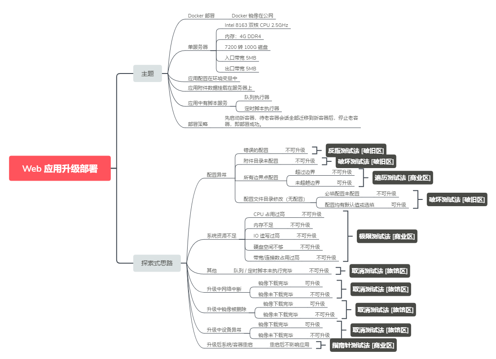

# 探索性测试在敏捷中的应用

探索式测试（Exploratory Testing）是 Cem Kaner 在 1983 年提出的。它是一种软件测试风格，强调测试人员的自由与责任的测试方法，为了持续优化其工作的价值，将测试相关学习、测试设计、测试执行和测试结果分析作为相互支持的活动，在整个项目过程中并行地执行。

## 探索性测试在敏捷中广泛使用的原因

大家可能注意到探索性测试的概念提出来的时间非常早，上个世纪80年代就出现了。但是探索性测试真正火起来是到2000年以后，大家可以看到各种关于探索性测试相关的讨论、视频、工具，在各个测试峰会上也会有很多主题是和探索性测试相关的，还有一些和探索性测试相关的一些书籍出版。

探索性测试搞的风生水起，是伴随着敏捷的发展而成长起来的。为什么探索性测试随着敏捷的发展能够得到很多人中重视呢？大家仔细想一下我们上面描述的探索性测试的特点：

1. 强调测试人员的自由与责任：这个是对测试人员自身的要求，换句话说给了测试人员更多的自由发挥的空间，这个敏捷宣言中提到的“个体和互动*高于*流程和工具”如出一辙
2. 学习、设计、执行和结果分析并行：看到这种描述，自然就想到敏捷中的迭代，相对于传统的线性开发模型，探索性测试天然和增量迭代开发保持了一致
3. 弱文档化：探索性测试从思想上强调测试人员的自我能动，给测试人员带来更多自由，在操作层面对文档化的要求相对降低，这和敏捷的具体操作有类似的地方

上面提到的这几个特点使得探索性测试在敏捷中大行其道。但是跳出这些特点，我们再向深层次思考。如果只给出一个探索性测试和敏捷比较匹配的原因的话，我认为是**很多敏捷团队中的测试人员来不及进行传统的脚本化测试，而不得不进行所谓的探索性测试。**

采用敏捷开发流程迫使测试团队在更短的时间周期内完成测试。以前需要数周或数月才能测试的团队，现在必须加速测试，以便在几小时或几天内提供更全面的测试结果。因此，必须在极大的时间压力下进行测试。如果还是按部就班的，从测试计划、测试设计、测试脚本编写、各种评审，然后搭建测试环境开始测试，整个一轮没有走完，开发人员都下个迭代都开发完了等你测试了，结果上个迭代的测试还没有完成。（如何避免这种被动情况，将测试尽可能的前移，不在本文的讨论范围内。）

## 探索性测试在敏捷中的实施

探索性测试的优缺点是比较明显的：

- 探索性测试的好处就是灵活自由，边学习、边设计和执行，从而在极短的开发周期内快速检测缺陷。
- 测试人员的要求很高。需要那种“召之即来，来之能战，战之能胜”的测试牛人。实践中，经常出现因为测试人员对产品理解不够，探索不充分，导致漏测。
- 探索性测试由于比较依赖单个的测试人员，在可管理和可监控方面需要设法弥补

探索性测试里面的弱文档化体现在，大部分情况都是不写传统的测试用例的。取而代之的，可能是称为“测试点”、“测试想法”等类似的称呼，用简短的文字来描述探索的目标。

### 思维导图在敏捷测试中的使用

用思维导图来组织测试点，就是在探索性测试中经常使用到的一种方法。

> 敏捷开发模式下的利刃 - 探索性测试:  http://bbs.51testing.com/thread-1183789-1-1.html

探索性测试看起来很简单，直接让测试人员去探索就可以了。但是想要获得好的探索性测试的结果，仍然是非常困难的。如果测试人员在传统的测试中都没有好的思路设计测试用例，那么可以想象在探索性测试中他也必然是比较茫然的。所以即使实施了探索性测试，传统测试中的测试思想仍然是非常重要的。

### 如果扩展探索性测试的思维

测试专家James A. Whittaker曾经是Cem Kaner佛罗里达工学院的同事，后来担任微软测试架构师以及Google总监，基于在这些公司的工作经验，他撰写了《Exploratory Software Testing》一书，进一步拓展了探索性测试的概念和方法。他在书中提到了很多探索性测试的方法，可以帮助测试人员进行更好的探索。

- 指南测试法：城市的题图通常都会标注一些热门的旅游景点，测试这些热门的区域是非常重要的。不管在任何一次发布的过程中，核心功能是肯定要覆盖到的。指南测试要求测试人员严格按照用户手册的建议执行操作，有可能是手册描述不到位或者核心功能并不像宣传的那样好。

- 卖点测试法：此方法是鼓励测试人员观看销售给客户演示的Demo，理解销售的角度哪些功能对客户来说是最大的卖点，他们未必就是核心功能，但值得测试人员把它们当核心功能来对待。同时，也许刁钻的客户会提出各种质疑，这些质疑和稀奇古怪的问题也可以纳入测试人员的设计中。

- 地标测试法： 在旅游的时候，如果我们设计了要到访的地方，通常会在地图上插上旗子，这就是地标。但是没有人规定我们应该按照何种顺序去到访这些地标。不同的测试人员可能会选择不同的顺序，有经验的测试人员会基于对软件产品架构和技术层面的理解，采取一些古怪的路径但更可能发现缺陷。

- 极限测试法：向软件提出难以回答的问题，比如最大可以发挥到什么程度，承受多少用户，承载多少数据。那个特性或功能会把软件逼到极限运作，哪些输入和数据会消耗软件最多的计算能力？哪些输入可能绕过它的错误检测？

- 快递测试法：快递运送的货物，就好比软件里的数据，结果不同的地点转接，拆包装包最终到底目的地。所以快递测试专注的是数据，跟随它们走遍整个软件。

- 深夜测试法：城市灯火阑珊会在午夜过后逐渐安静下来，商场店铺纷纷打烊。但是软件不应该停止工作，软件测试人员有时应该刻意的关注在冷门时间段软件所做的附属工作，比如数据备份归档、维护监控任务的运行等等。

- 博物馆测试法：这是针对软件的遗留代码，保留了些许年代的一些功能，找出它们来验证是否有出现失效。当初开发它们的时候，甚至可能缺乏文档，但这并不意味着它们应该被忽略。

- 深巷测试法：在每个城市，都有些地方并不吸引游客意味着不吸引人群，但作为测试人员来说，反而是这种最不可能被用到或者最不吸引用户的特性，容易潜藏着难以发现的Bug。

- 通宵测试法：繁华的都市总会有通宵热闹的地方，比如夜总会KTV之类的，它们从不中断。那么应用程序是否也能坚持到最后呢？当它面临持续不断的调用、输入、重读重写之类的操作，如果运行时间足够长，就很可能会出问题，内存会需要回收、数据需要清空，永远不要关闭它，保持不间断的运行。（更多的时候会采用自动化或者机器人思想）

- 长路径测试法：把那个在应用程序埋藏最深的界面当做测试目标（离起始点最远的那个界面），观察经过的每一个界面

- 超模测试法：针对UI的表面测试，衡量软件的展现能力，像T型台的超模那样，不去关注她们幕后的辛酸痛苦劳累，跳出产品专家或测试的头衔，以普通观众的角度，去关注那些能看到的界面展现，元素是否被正确绘制、是否难看、颜色风格是否一致、界面的切换变化是否表意清晰？

- 取消测试法：此方法的思想是启动了立即停止，特别是一些运行流程比较耗时的功能如备份还原或者搜索，在启动之后，立即取消。发散一点还可以变成，启动一个耗时操作，不停止立即启动另外一个耗时操作，以此来检测应用程序的自我清除能力。

- 懒汉测试法：选择尽可能少的输入，能不输入尽量不输入，能不修改尽量不修改，观察应用程序是否能响应得出正确结果。

- 反叛测试法：你见过去酒吧不喝酒点果汁的么？反叛思想要求输入最不可能的数据，或者已知的而已输入，测试人员可以采用逆向思维、明知一些数据违反规则，却偏偏要采用这样的数据，或者不按照正确的顺序来输入。

- 强迫症测试法：测试人员强迫软件一边又一边接受同样的数据，反复执行同样的操作，最重要的特点就是重复。此种思维方式，常常打破了开发人员设计代码的思路，他们预想着你会按步骤操作，却不曾考虑过你反复的执行第一步应该如何处理。

> 探索性测试总结笔记，原文链接：https://blog.csdn.net/ant_ren/article/details/8230290

### 基于会话的探索性测试的管理

在探索性测试中，测试设计和测试执行是同时进行的，并且由一个准备就绪的测试章程所引导。测试章程提供相应的测试条件来覆盖一段固定时间的测试。在探索性测试期间，最新的测试结果会引导下一次的测试。在测试设计时，探索性测试同样可以使用前面所提的白盒和黑盒技术。

为了管理探索性测试，我们可以用一种被称为基于测试会话（session based）的测试管理方法。测试会话被定义为一个可以持续 60 分钟到 120 分钟而不被打断的测试周期。测试会话包括以下过程：

- 调研会话（学习和了解系统是如何运作的）；
- 分析会话（对功能或者特征的评估）；
- 深度覆盖（不常见的情况、场景和交互）

基于会话的测试管理是一种用于管理探索性测试的方法。这里的会话（Session）是指测试工作的基本单位，在一个会话中测试工作是连续进行的，不会被打断。会话中的测试活动是为了实现某个具体的目标，同时测试活动的结果是可评审的。任何可能会被电话、会议、电子邮件或其他非测试活动打断的测试活动，都不适合成为一个会话。在一个会话中，测试人员应该专注于测试活动而不被打扰。在每个会话结束的时候，应创建描述已进行的测试活动的报告，该报告通常称为会话单（Session   Sheet）。测试会话被定义为一个可以持续 60 分钟到 120 分钟而不被打断的测试周期。

测试会话包括以下过程：

- 调研会话（学习和了解系统是如何运作的）；
- 分析会话（对功能或者特征的评估）；
- 深度覆盖（不常见的情况、场景和交互）

探索性测试中虽然不用编写测试用例，但是为了更好的管理，需要测试人员生成测试章程。一个测试章程可以包含以下信息：

- 行动者（Actor）：系统的预期用户；
- 目的（Purpose）：章程的主题包括行动者想要达到的特殊目标，也就是测试条件；
- 设置（Setup）：为了开始测试执行所需要准备的事项；
- 优先级（Priority）：此章程的相关重要性，基于相应的用户故事的优先级或者风险等级；
- 参考（Reference）：规格说明（如用户故事）、风险，或者其他信息源；
- 数据（Data）：任何用来执行此章程所需的数据；
- 活动（Activities）：包含行动者想要与系统进行的交互动作（如“作为超级用户登录到系统上”）和有兴趣进行的测试（包括正向和逆向测试）的清单（想法清单）；
- 准则（Oracle notes）：如何评估产品，从而确定正确的结果（如，来获取屏幕上所发生的事件并且与用户手册的内容比较）；
- 变化（Variations）：可供选择的行动和评估来补充在活动部分中所描述的想法。

测试质量取决于测试人员对测试内容的相关问题的提问能力。提问的例子如下：

-  哪些与系统有关的信息是最重要的，需要被发现的？
- 在什么情况下系统会失败？
- 如果……会发生什么？
-  当……应该发生什么？
- 是不是满足了客户的需要、需求和期望？
- 系统是否能在所有支持的升级路线内安装（或者必要时进行卸装）？

每个测试会话完成后，测试人员要填写会话单。基于会话的测试管理中的会话单主要包括：

会话章程（Session Chapter）：主要描述会话的任务和可能采用的策略，会话的章程可能是测试人员自己选择的，也可能是测试经理分配的。

1. 测试人员姓名。
2. 起始的日期和时间。
3. 任务分解（以会话的形式）：通常分别描述测试设计和执行、缺陷调查和报告。
4. 数据文件：描述测试会话中使用的数据文件。
5. 测试备注：对于测试活动中的任何特别的说明都可以记录在这里。
6. 问题：描述测试过程中碰到的问题，例如：由于测试环境不足，有些测试没有执行。
7. 缺陷：描述测试过程中发现的缺陷。

测试经理根据测试人员提交的会话单，在测试团队内进行任务报告会议。在任务报告会议中，测试经理回顾测试活动、改善章程、从测试人员处取得反馈、估算和计划进一步的会话。任务报告的议程主要是简要地检验以下各项，并明确下一步的测试会话章程。

1. 经过：在会话期间发生了什么？
2. 结果：会话取得了什么成果？
3. 展望：还有什么有待解决的问题？
4. 障碍：要进行良好的测试有些什么障碍？
5. 感受：测试人员对上述项的感觉？

在探索性测试中，测试的对象和内容比较发散，经常出现具体的测试活动和会话章程不一致的情况。那么在最后的会话单中要对会话章程进行修改，以保证提交的会话单如实地反映了实际的测试活动。如果需要的话，也可以新建一个新的会话来记录这次测试活动。虽然不建议会话的持续时间太长，但是在实际的测试过程中，仍然会出现一个会话占用测试人员一整天的情况，通常可能是因为会话环境的搭建或者缺陷的调查花费的时间比预期的要大。这种情况下也没有必要强行把会话拆成多个更小的会话，可以根据测试的需要保留这些持续时间较长的会话。一个测试会话最好是在没有被打断的情况下持续地进行，但有时候可能需要参加一个紧急的会议，或者开发人员修复紧急的缺陷而需要测试人员的帮助，这个时候测试会话不得不被打断。这种情况下，测试会话的中止和恢复是允许的。

# 小结

探索性测试一方面给了测试人员更大的自由和灵活度，另一方面也对测试人员的能力提出了更高的要求。为了更好的管理探索性测试，必须在完全自由和完全的脚本之间进行取舍。