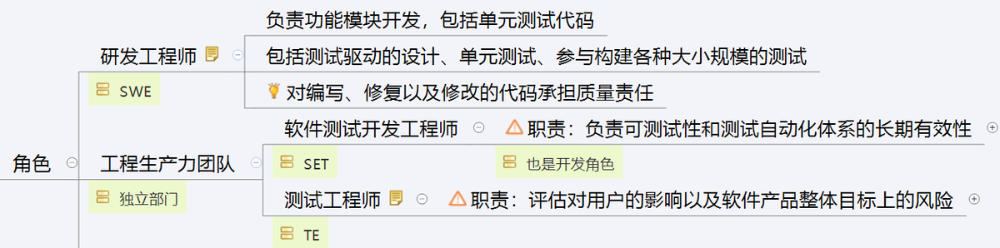
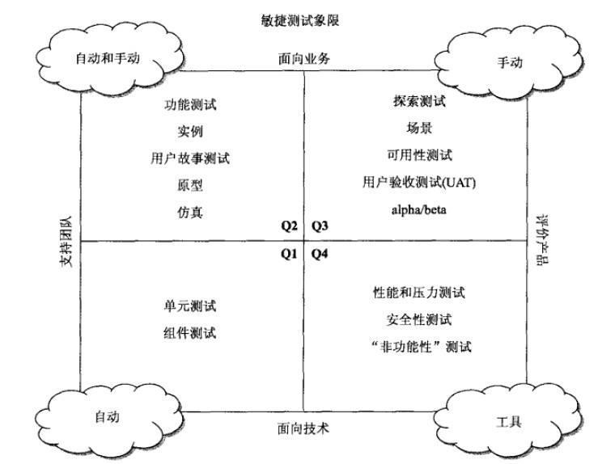

# 敏捷中的独立测试团队会消失吗

当敏捷的春风吹在世界大地上的时候，最恐慌的是谁呢？不管传统项目中的其他角色的心情是如何的，大部分测试人员肯定是惴惴不安的。为什么？大家学习了敏捷后，发现其实没有测试人员什么事啊！在敏捷中，测试这个活本身还是在的，但是执行的主体发生了重大变化，那就是很多测试的职责从原来的独立的测试人员身上转移到了开发人员身上了。就像什么测试驱动开发、验收测试驱动开发、持续构建、持续集成、持续交付等，这些活动中都需要测试，但是这些测试任务可能都会由开发人员来完成。

再加上各位大牛的各种宣传，很多测试人员一时之间不寒而栗。Google在2011年GTAC(Google Test Automation Conference)的Keynote就是Test Is Dead。James  Whittaker在StarWest 2011的演讲All That Testing is Getting in the Way of Quality。然后得出一个结论：测试人员的薪水在未来一定会缩减，尤其是next generation上来之后。这两个演讲都是围绕Cost和Quality两方面讲测试已死的，而这里的测试已死，死的不是测试，死的是测试工程师。因为软件开发并不一定需要测试工程师，而测试工程师根本没有提升任何软件质量。软件的质量由始至终都是在开发工程师手中的。

> Test is Dead: https://v.youku.com/v_show/id_XMzI0NjYyOTQ4.html

作为一个从事独立测试二十年的“资深”从业人员，在战战兢兢的工作了这么多年回头再看敏捷中的测试。我们会发现现实没有想象中的那么差，当然也没有梦想中的那么好。但是，显然整个独立测试群体并没有消亡。

敏捷宣言从2001年提出，里面很多的实践和方法在上个世纪90年代甚至更早就出现了。在IT世界，接近20年的时间其实非常长了，但是我们在2019年的当下看敏捷中的测试，还是以各种不同的形式存在。所以可以大胆的预测在未来20年，不管传统还是敏捷甚至其他新的概念出现，独立的测试团队应该会长期稳定的存在。

在我们思考为什么测试团队会长期存在的原因之前，我们先来看看今天的敏捷中的测试到底是以什么方式存在的。注意这里的说的是测试，不仅仅是独立的测试人员。

## 现实世界中敏捷团队的测试

现实世界中，敏捷团队的测试独立性就和全国人民的收入一样，处于各种水平都有。敏捷团队中的测试从完全独立测试团队到全部由开发人员完成都是存在的。学习敏捷或者看各种大牛的文章的时候，你可能觉得测试眼看就要完蛋了。但是回到现实生活，你会发现能够把传统的测试最好的团队其实都不多，就不要说敏捷团队中开发人员做测试的效果有多好了。

下面是一个简单的示意图。最左边是测试全部由开发人员负责，最右边是由完全独立的测试团队来完成。从左到右，大部分团队都处在这两个极端情况之间，有些是偏开发一点，有些团队偏独立测试一点。

下面给出三种敏捷测试团队中的状态，供大家参考。这三个场景没有好坏之分，关键是要找到合适自己当前组织情况的平衡。

### 场景一：所有测试主要由开发人员负责

这这种场景下，开发人员负责大部分的测试。会存在少量的测试人员，这些测试人员主要负责一些大型的测试或者类似用户验收这样的测试，从系统的角度来评估产品；同时这些测试人员可以为开发人员的测试提供必要的支持，例如指导开发人员设计测试用例、为开发人员的测试提供工具方面的支持和指导等。

James Whittaker等写了一本书，中文翻译的版本叫《谷歌的软件测试之道》。里面介绍了关于谷歌如何进行测试的内容。其中有很多项目就是我们这里讨论的这个场景。测试人员在里面属于工程生产力团队。这个名称就已经很好的体现了这个团队的主要作用了。

> 读Google是如何做软件测试的：https://www.jianshu.com/p/cb4c92ad080b

### 场景二：测试任务在独立测试团队和开发团队之间的平衡

就像传统的测试一样，敏捷中的测试也不是只有一个观察的维度。敏捷中的测试仍然有不同的测试级别，例如：单元测试、集成测试、系统测试或者验收测试等。同样一个敏捷团队，不同的测试级别上测试的独立性可能是不同的。例如：

| 测试级别 | 开发人员完成 | 独立测试人员完成 |
| -------- | ------------ | ---------------- |
| 单元测试 | 是           | 否               |
| 集成测试 | 是           | 否               |
| 系统测试 | 否           | 是               |
| 验收测试 | 否           | 是               |

### 场景三：强势而独立的测试团队

在这个场景中，测试团队以一种非常独立的形式存在。他们是所有测试活动的主要贡献者。当然也并不意味着开发人员完全不用做测试。常见的代码相关的单元测试很大程度上依然可以由开发人员来完成，但是测试人员要负责提供指导，同时要对开发人员的测试进行监督和审核。

Lisa Crispin 和Janet Gregory在她们写的《敏捷软件测试》中提出“敏捷测试四象限”。

> 《敏捷软件测试》作者：（美国）克里斯平（Lisa Crispin） （美国）格雷戈里（Janet Gregory） 译者：孙伟峰 崔康,出版社： 清华大学出版社    出版时间： 2010年10月1日   ISBN: 9787302236535

四象限划分的合理性不在我们这篇文章的讨论范围内。这里主要应用这个四象限中涉及的各种测试类型，来看一下强势而独立的测试团队的职责。在这个场景下，开发团队可以负责第一象限中的测试任务，而其他三个象限中的测试任务都由独立的测试团队来完成。

但是在敏捷环境下，过于独立的测试团队，显然会在快速迭代的要求方面遇到极大的挑战。如何尽可能的将测试左移，缩短缺陷从被开发引入到被测试发现之间的时间间隔，都是测试团队需要努力提高的。

## 敏捷后独立测试仍然会存在的原因和价值

大家可以回想一下敏捷宣言和它的12条原则。里面其实从来没有涉及到测试独立性的问题。毕竟人家大牛的思考角度都是用户价值。所以测试到底以什么方式存在和运行，主要取决于如何更好的服务于产品的交付。

抛开敏捷不谈。我们看一下传统的软件开发中，为什么需要测试？那么通常可以列一大堆测试目标，包括评估工作产品、预防缺陷、发现缺陷、提供信息、降低风险和法规要求等。那么这些测试的目标到底是什么原因触发的呢？关键就是：**开发没有办法做到完美是测试存在的根本原因**

换句话说，上面我们讨论了不同的团队中测试是从完全由开发完成到由独立的测试团队完成之间的一个平衡。当开发人员的交付能力越强，那么对独立测试的需求就越少。

看一下敏捷中很多实践，目的都是为了帮助开发人员更好的为客户提供有价值的交付，帮助开发团队更加完美。例如：测试驱动开发、行为驱动开发、每日构建、持续集成等。这些都能够

- 使得开发人员的交付能力变得更强
- 能够更好的交付对客户有价值的产品
- 能够缩短从引入缺陷到发现缺陷的时间
- 尽可能的避免出现大量的缺陷
- 尽可能在短的时间内解决开发过程可能碰到的问题

如果开发人员足够牛，能够很好的把握客户需求，在开发的代码中没有缺陷，或者及时出现缺陷也能够快速发现并修复，那么测试人员的价值显然会降低。

敏捷其实对开发人员有了更高的要求，同时也提供了很多实践和方法来帮助开发人员自我改进。你见过完美的不需要独立测试的开发团队吗？在开发人员普遍能力高的敏捷团队中，是可以做到的。但是非常“幸运”的是，仍然存在大量的开发人员在开发过程不够完美，从而给了独立测试人员存在的价值。

整个IT领域的不平衡，就像整个国家人民的收入一样多样化。有一些公司中的优秀团队很牛，但是仍然存在很多不是那么优秀的团队，而且在可以预见的10年甚至20年内，这种团队仍然存在，这个是IT领域一直在努力提高的，但是也是测试人员值得“庆幸”的。虽然，独立测试在未来很多年仍然会长期广泛的存在，但是并不意味着测试人员就可以守株待兔的保持不变。

随着越来越多的团队向敏捷转型，测试人员也需要不断的学习新的技能以适应这种变化。敏捷中快速迭代、持续交付的特点，推动着测试的变革。测试团队需要思考：

- 如何能够缩短测试的时间
- 如何能够尽早的发现、甚至预防缺陷
- 如何能够不断的降低测试的成本
- 如何能够帮助开发人员进行测试
- 如何开发或者使用更先进的测试基础架构

### 小结

**在可预见的未来，开发没有办法做到完美，从而保证独立测试能够长期存在**。但是在整个开发人员的技能不断改进的情况下，测试人员也必须能够不断的提高自己才能匹配上整个团队成长的步伐，否则即使没有被开发人员革命，也会被其他测试人员革命。**不论最终独立的测试人员是否会消失，没有价值的测试人员必然会消失的。**