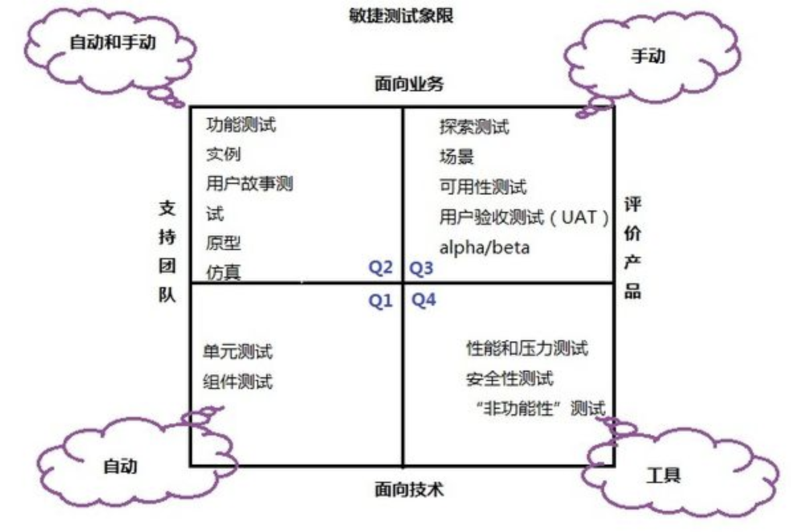

敏捷测试自动化
==============

将敏捷法则应用到测试自动化上
--------------------------------

每个团队、每个项目以及每个企业都会遇到独有的自动化挑战。每个企业都有自己的文化、历史、资源、业务压力、产品和经验。无论你所在团队处于何种情况，你都可以使用敏捷法则和价值来寻找解决方案。勇气、反馈、简化、交流、持续开发和快速响应这些概念不仅仅属于敏捷，他们是所有成功团队所应具备的特质。

### 1 保持简单

保持测试设计简单、保持范围最小化，使用最简单的工具完成工作。

简单是敏捷的核心价值。上手的最好方式就是你所能想到的最简单的方式。它需要思考哪些东西并设法达成目标，保持简单，如果做出了错误的决定，那么在发现错误之前不会偏离轨道太远。

我们很容易陷入到任务中并从基础转向挑战当中。在做之前需要先衡量一下每个自动化任务的ROI。尝试困难的东西很有吸引力，因为可以解决那些难题。与敏捷开发项目中其他测试方面一样，跟进的唯一方法就是只做需要的东西。

使用你能找到的最简单的工具。如果大部分客户测试能在单元级别自动化，那就在该处进行。例如使用FitNesse编写测试用例，程序员可以像Junit测试那样使用使其快速自动化，使用FitNesse来代替Junit进行TDD，所编写的代码有助于在FitNesse设施中进行测试。

### 2 迭代式反馈

凭借短期迭代，我们可以试用各种自动化方法、评估结果并根据需要尽快改变过程。我们可以在自动化上付出很多努力，比如几个迭代内在内部开发出测试框架或是实现出开源工具。在每个迭代结束后，看看哪些是好的，哪些是不好的。思考解决问题的方法并在下一个迭代中尝试这些方法。如果这不是正确的方案，请在随后几个迭代中尝试其他方法。不要将太多资源投入到一个工具当中，不要用一种工具进行过多的测试，这样就无法切换工具了。在众多的开源与商业工具之间，再加上程序员编写的土生土长的测试工具，我们没什么理由找不到合适的工具。

*Lisa的故事*

*我早期所在的XP团队努力尝试为一个基于Java的Web应用找到自动化客户验收测试的方法。对于敏捷团队来说，工具匮乏的日期已经一去不复返了。首先，我们尝试了一个能够模拟浏览的开源工具，但它缺少我们需要的特性并且不够健壮。*

*我们决定在随后的两个迭代中使用单元测试工具来测试GUI后的代码。通过这两个迭代，我们觉得时间分配很充裕，可以很好地尝试工具，但如果它不是正确的方案则时间就变少了。客户发现单元测试很难阅读，此外GUI中还有一些逻辑是该工具所无法测试的。*

*在回顾过程中的另一场讨论结束后，我们决定在接下来的两个迭代中使用我在之前项目中曾经使用过的GUI测试工具。Java程序员发现其运行速度很慢，因为该工具使用了一个私有的脚本语言，但其完全符合最小化的自动化需要。在两个迭代约束后，我们认为它不太理想，但那时还没有更多的选择，它就是我们能找到的最好的工具了。*

*事后，我们本应该再去寻找更好的工具，或许我们还能开发出自己的测试工具。我们使用该工具可以自动化单元级别上60%的回归测试，当时看起来这已经非常了不起了。如果我们能再主动一点，我们本可以做的更好。*

迭代是非常有好处的。他们使得逐步的方式变得更加简单。如果想法不成功，那么很快就能知道答案并采取其他方式。不要害怕寻找，但如果工具已经够用了，那就不要再去寻找完美的方案了。

### 3 整体团队运作方案

若没有自动化，敏捷开发将寸步难行。整体团队运作方法意味着有很多技能和资源可用于实现自动化之道。以团队的名义意味着代码在设计时会更多的考虑到可测试性。程序员、测试人员以及其他的团队成员会联合起来进行自动化测试，汇集不同的视角和技能。

整体团队运作方案有助于克服恐惧。团队都会选择以自动化作为起始点。了解其他人拥有着不同的技能和经验会给予我们勇气。可以寻求帮助会给我们信心，我们能够通过自动化测试获得足够的覆盖率。

*Lisa的故事*

*下面的示例是为了成功进行自动化而需要的一些辅助措施。*

*早期，在没有自动化测试，开发人员还在学习测试驱动开发时，我们决定使用canoo
webTest进行GUI冒烟测试。我需要一些帮助来理解如何配置Webtest以运行在我们的环境中，我需要帮助从自动化构建过程中运行这些测试。我咨询了系统管理员（也是一个程序员）来寻求帮助。我们很快就在构建当中积累了一个测试套件。*

*接下来，我想使用fitnesse完成GUI后面的功能测试。不得不保持耐心，因为程序员们仍然在解决自动化的单元测试。团队同意试验该工具，但却很难挤出时间。我找到了一个适合于fitnesse测试的故事并咨询程序员是否可以与其结对来尝试fitnesse测试。他同意了，接下来就实现了fitnesse下的一些自动化测试。那个程序员发现它很简单，也值得使用，并为团队的其他成员做了一场报告。*

*之后，我就能比较轻松地说服每个程序员为所从事的故事编写fitnesse测试了，还能让其看到结果。Fitnesse测试发现了程序员没有考虑到的测试用例，他们立刻就能看到其带来的好处。当团队的每个成员都具备了使用该工具的经验后，他们不仅变得热衷于自动化测试，还以能够简化编写fitnesse设施的方式设计代码了。*

*在我们的ruby专家（设计了大多数watir测试套件）离开公司时，我很担心该如何维护大量的测试套件以及如何编写新的测试。我的Ruby技术不如他（再加上我们只有一个测试人员了，时间也是个问题）。团队每个程序员纷纷走出去，买了ruby书，在修改代码时，一旦我遇到了脚本上的问题，他们都会过来帮我。其中一个程序员甚至在我没有时间的时候编写了一个全新的脚本来测试新的故事。在我们招聘到一个新的测试人员时，他和我都可以处理Watir脚本，这样程序员们就不用管这些事情了。*

*我知道我可以求助于团队中的其他成员帮我完成自动化相关的任务，整个团队
都认为自动化占据了很高的优先级，这样程序员在设计代码的时候总会考虑到可测试性问题。这是整体团队运作方案的一个鲜活例子。*

专门的面向技术的测试（如安全或负载测试）需要团队外部专家的帮助。一些公司拥有专家团队可以帮助产品团队。即便能够利用上这些资源，敏捷团队也应该保证完成所有类型的测试。如果团队成员参与了创造性的过程，那么他们会发现这些成员已经具备了所需的技能。

一些组织拥有独立的测试团队，他们完成开发后的测试工作。他们通过测试来保证软件可以与其他系统集成，或是进行其他专门的测试，比如大范围的性能测试等。开发团队应该与这些团队紧密合作，使用所有测试的反馈来改进代码设计并推进自动化。

### 4 花时间做正确的事 

解决问题与实现好的解决方案都需要时间。我们必须帮助管理层理解，要是没有足够的时间做正确的事情，技术债务就会不断增长，我们的速度就会下降。以“正确的”方式实现解决方案需要花费时间，但从长远来看这么做会节省时间。想想为寻求想法、解决方案的头脑风暴以及常规培训和工作中学习所花费的时间吧。

企业的管理层对尽快产生出结果非常感兴趣，如果管理层不愿意给团队时间来实现自动化，那么请你好好权衡一下。从短期来看，不使用自动化的回归测试来交付特性会导致巨大的代价。就像团队不断积累技术债务一样，你将无法交付管理层所需要的业务价值。工作时请好好权衡一下。比如，去掉一个特性，但应该保证必要的价值，使用自动化来交付并维护更好的产品。

我们总会面临最后期限，我们总是感到时间的压力。虽然明知道不行，但按照以前那种方式进行工作的诱惑「比如手工执行回归测试等」总是存在的，永远不会在足够的时间来回到过去并修复问题。在下一个计划会议中，请拨出一些时间用在关于自动化的一些有意义的过程上。

*Lisa的故事*

*我们的团队关注于如何将时间花在，良好的设计、健壮的自动化测试套件上，以便为探索性测试分配充裕的时间。质量（而不是速度）是我们追求的目标。我们的产品问题需要花费很大的代价来修复，因此整个公司都花费很多时间来预防这一点。有时，我们没有采取正确的设计，但在认识到这个问题后，我们并不害怕使用正确的设计将其替换掉。*

*很自然，业务上的妥协是存在的，业务决定了是否在风险已知的情况下继续进行。我们会清楚地解释所有的风险并给出潜在的场景示例。*

*下面几个示例阐述了如何花费时间做正确的事情。我们开启了一个新的主题对退休金计划的账户结果单进行了比较大的修改。程序员Vince palumbo负责收集额外的数据用于结单上。他决定为数据收集功能编写健壮的单元测试，即便这意味着故事不得不持续到下一个迭代中。编写单元测试花费了他相当多的时机和精力。而测试代码也是非常复杂和难以实现的。几个迭代过后，另一个程序员Nanda Lankalapalli开始了与数据收集相关的另一个故事，令人惊讶是，他开发了新的单元测试，他可以快速做出改变，由于单元测试就绪，测试代价集聚调整。*

*总之，我们发现忽略了一个边际情况：账户值改变的另一些计算不正确。自动化的单元测试和大量的探索性测试都不足以捕获所有的场景。拥有这些测试意味着Vince可以编写正确的代码并相信现在的代码是正确的。*

*最近的另一个例子是关于入账检查处理。业务想要将两个处理步骤缩短为一个，这意味着钱可以提前两天打到退休金计划账户中。现有的过程都是由遗留代码编写的，没有单元测试。我们讨论是否采用新的架构重写整个过程。产品所有者担心这么做的时间太多了。我们认为修改现有代码与完全重写所花费的时间是差不多的，因为旧代码实在是太难读懂了，还没有单元测试。我们决定重写代码，这不仅会降低该关键功能的风险，还有机会花费较少的代价增加额外的特性。到目前为止证明这种策略是正确的。*

让自己成功，以可承受的节奏工作。离开前或是最后遇到了大麻烦时请花些时间进行重构。作为测试人员，我们总有不同的任务要完成。如果你在学习一种新工具或是自动化新的测试，那么请不要同时进行多任务处理。找一大块时间并集中精力，虽然这很难。

如果业务负责人急切盼望团队完成好任务，那么请和他一起来分析问题。风险是什么？产品问题要花费多少时间解决？发布一个快速的修复有什么好处？它会增加多少技术债务？拥有自动化测试支持的健壮设计的长期ROI如何？每种方法是如何影响着公司利润和客户满意度的？无形代价【比如低质量的工作】对团队士气的影响是多少？有时业务是正确的，但我们敢打赌，你经常会发现前期投资是很值得的。

### 5 边做边学

每个人的学习方式都不同，但在决定了如何自动化测试后就请开始做吧。在everyday scripting with ruby for teams,testers,and you[2007]一书中，brian marick 建议通过编写程序来学习编程。请犯错吧！问题越多，学的越多。找个人与自己结对会加快学习的速度，即便是两个人都不熟悉该工具或语言也是如此。

如果找不到人结对就自言自语吧！解释的过程经常会暴露出问题所在。自言自语地读着测试有助于发现其中的缺陷。

### 6 将敏捷编码时间应用到测试上

测试与产品代码一样具有价值。事实上，如果没有测试的支持，产品代码也就没什么价值了。应把对待代码的态度用在测试上。与产品代码一样使用源码控制工具。你应该总能识别出与特定版本的代码匹配的测试脚本版本。

结对、重构、简单设计、模块化与面向对象设计、良好的标准、尽最大努力保持测试的独立性----优秀代码的特质也适用于优秀的自动化测试。人们有时看到敏捷开发非常混乱和松懈，但实际上它是高度自律的。通过最棒的几率保证自动化任务，小步前进，就像任何敏捷程序员编写产品代码一样，但请保持简单。如果没有良好的ROI，那么请不要编写带有大量逻辑的怪异测试脚本。那些测试还需要测试，并且需要花费时间去维护。在可能的情况下指定测试而不是编码，尽量使用最简单的方法。

测试自动化是团队工作的结晶，这句话怎么强调都不过分。不同团队成员的各种经验、技能以及观点可以搭配在一起产生出最佳的自动化方法。创新----请保持创造力。无论大家说什么，请解决自己所遇到的特定问题。

自动化工具仅仅是一块比萨而已。测试环境和测试数据是必要的组件。

测试自动化的敏捷方法
------------------------

### 自动化测试的分类

本节以不同的视角重新审视测试象限。先来仔细看看象限图，如下图所示：

我们将支持团队的两个象限（象限一和象限二）标记为使用自动化。在象限四中，从技术视角来看，用于评价产品的工具通常也需要自动化。采用自动化业务测试工具来支持团队。只有象限三----评价产品的业务测试----没有标记为使用自动化。工具对于某些测试来说还是有用的，比如，自动化可以创建好测试数据和用户场景对日志进行分析。

请通过每个象限来识别每个项目（甚至是每个迭代）所需的各种自动化工具。仔细检查每个象限并给出所需工具的清单。假设我们准备重新设计UI，看看象限一，怎么能做测试先行呢？我们知道如何对表现层进行单元测试么?需要新的工具完成这项任务么？看看象限二，我们需要作出原型：仅仅写在纸上就行了么？还是需要创建一个Oz类型活动向导？需要使用什么工具创建可执行的业务测试来指导开发呢？需要更新或是替换掉现有的回归测试脚本么？我们知道象限三中有一个活动叫做可用性测试。这需要提前做好测试。我们希望通过工具追踪用户活动，这样就可以进一步分析这些活动了。看看象限四，我们发现负载测试脚本使用的还是旧的UI，因此不得不花些时间将其更新到新的UI上。

正如第三部分所强调的，象限的顺序与测试的顺序没有什么关系。在准备好每类测试所需的工具清单后，我们会考虑何时进行测试，这样就会提前准备好自动化工具。比如，某个团队重新设计了一个新的架构并打算尽快运行可伸缩性测试。这样，他们就需要在项目第一个迭代中花些时间来寻找或是实现性能测试工具。

象限有助于我们了解所需的工具，但各个层次上有这么多自动化工具，我们该何去何从呢？因此有必要了解不同类型的测试所适用的地方以及如何组织这些测试。为了快速、频繁的交付价值，自动化需要高度的ROI。测试金字塔可以帮助我们优化对测试的投入。

哪些测试可以自动化
----------------------

你能想到的大多数测试类型都得益于自动化。手工的单元测试并不会阻止回归失败，因为每次在万事具备的情况下执行一套手工测试并不现实。你也无法通过手工的单元测试保证测试先行。一旦程序员不能通过单击按钮快速执行测试，他们就不想再执行测试了。我们可以通过手工的方式测试不同单元的代码以保证其正确运行，但自动化的组件测试是更有效的安全网。

手工测试有助于发现功能上的缺陷，但如果没有足够多的自动化业务回归测试，我们还需要花费很多时间跟进手工回归测试。来看看可以通过自动化完成的各种测试吧。

要想运行自动化测试，需要一些自动化框架，这样程序员就可以经常签入代码、运行测试并创建部署文件。首先看看这方面的内容。

### 1 持续集成、构建与部署

自动化最适合于软件开发中那些单调、重复的工作。我们已经讨论过自动化构建过程的重要性。意识不到这一点就无法构建自动化测试金字塔。团队需要来自于单元级别测试的快速反馈。每当签入变化时就发送自动化构建邮件，这对于测试人员很有帮助，因为他们知道何时可以对构建进行测试了而无需打扰程序员。

自动化部署过程也会加快测试的速度并减少错误。部署是一个手工的过程，部署本身其实非常简单，但是若把文件放到了错误的地方，就可能会陷入部署的泥潭。一开始就采用持续集成和构建框架，细心检查，也就没什么难的。做起来也很快。若是庞大、复杂的项目，则会面对更大的障碍。

有的团队构建花了两个多小时，意外着程序员在签入代码后不得不等待两个多小时才能知道此次签入是否会破坏现有的功能，时间太长了。

大多数敏捷团队发现构建时间超过8-10分钟就没法工作了。对于反馈来说，甚至15分钟都太长，因为签入会堆叠起来，测试人员需要等待很久才能拿到最新的构建。当构建时间到两个小时的时候，程序员会感觉到已经到了迭代或是发布周期的末期。如果新的签入破坏了任何功能，他们不得不再等两小时来看问题是否已经修复。

在很多时候，构建时间过长是因为要访问数据库或通过界面进行测试。针对庞大的代码基运行的众多测试会占用很多机器资源。应分析一下测试，看看瓶颈在哪里。比如，如果是因为数据库访问导致了问题，那就尝试模拟真正的数据库，使用内存数据库代替。配置构建过程，将测试分布到几台计算机上去。看看不同的软件是否能更好地管理资源。如果需要，请咨询团队外的专家。

加快持续构成和构建过程的关键在于一次只进行一小步。一次只引入一个变化。这样就可以单独度量每次成功了，同时也明白自己正在正确的路上。要想起步，只需去掉最花时间的那些测试并使用每夜构建来代替每次构建。

快速运行的持续集成和构建过程是对自动化的最好回报。这是每个需要自动化的团队首先要做的一件事。一旦就绪，团队就可以从自动化测试中获得反馈了。接下来，我们来看看哪些测试类型需要自动化。

### 2 单元与组件测试

我们必须强调自动化单元测试的重要性。如果程序员将TDD作为一种编写测试的机制，那么他们不仅会创建出很棒的回归测试套件，还会通过其设计出高质量、健壮的代码。如果团队没有自动化单元测试，那么从长远来看，其成功的机会是非常渺茫的。请将单元测试自动化与持续集成放在首要位置上。

### 3 API 或 web services 测试

通过自动化来测试API或Web Services
非常简单。Janet所在的团队成功使用过Ruby来读取电子表格（里面充满了输入变量）并与另一张表格中的期望结果进行比较。这些数据驱动的测试易于编写和维护。

Janet的一位客户使用Ruby的IRB（Interactive Ruby Shell)测试Web Services以实现验收测试。Janet的团队希望与客户所在团队共享脚本，但业务测试人员希望看到如果输入发生了变化会发生什么事情。以半自动的交互方式执行测试可以达成这一点。

### 4 测试 GUI 底层的测试

GUI底层的测试要比GUI测试本身更易于自动化。由于测试不会受到展现层变化的影响以及面对的是更加稳定的业务逻辑代码，这些测试更加稳定。这类测试工具通常都可以声明的方式编写测试，使用表格或是电子表格。我们可以快速编写好测试桩（让产品代码接收输入并返回结果）。这是业务测试绝佳的使用场所，无论客户还是开发人员都能够理解。

### 5 测试GUI

即便是没什么业务逻辑的简单GUI也是需要测试的。敏捷开发的节奏很快，每个迭代都需要交付新的功能，这一切都需要在GUI层进行一些自动化回归测试。

对于成功的GUI自动化来说，工具的选择至关重要。自动化脚本需要足够灵活并易于维护。Janet成功使用果Ruby和Watir，其框架是使用优秀的编码实践进行开发的，本身就好像是产品应用一样。程序库的开发需要一些时间，但代码中就没有多少重复工作了，变化也是放到一个地方。这一切将简化代码的维护，同时也提升了ROI。

关于可测试性的一点是----请确保程序员命名了这些对象或是给其赋予了ID值。如果使用系统生成的标识符，那么每次向页面增加新的对象，ID值都会发生变化，这么做还需要修改测试。

请只测试实际的界面。对诸如按钮确实响应用户的单击并按照预期工作等事情进行检查。请不要测试业务功能。另一种可以轻松自动化的测试是链接检查。我们无需手工检查每个页面上的链接以保证其是正确的。寻找那些易于达成的目标，首先自动化那些易于自动化的东西，这样就有更多时间接受更大的挑战了。

### 6 负载测试

某些类型的测试只能通过自动化完成。手工的负载测试通常都不可行，也不准确，虽然我们曾经都这么做过。性能测试需要监控工具的帮助以及驱动行为的手段。如果没有工具的帮助，你无法通过大范围的攻击来验证站点是否可以经受住攻击或是能否处理大量的负载。

### 7 比较

如果首次解析文件并以可读的格式将其展现出来时，通过系统进程来检查ASCII文件输出将变得非常简单。编写一个脚本来比较输出文件以确保没有无意的变更要比手工快得多，也更加准确。文件比较工具非常多，从免费的Diff到私有工具如WinDiff。源代码管理工具和IDE都有自己内建的比较工具。每个测试人员的工具箱中都应该有这些工具。在测试数据或数据迁移项目时，不要忘记通过脚本来比较数据库表。

### 8 重复的任务 

在与客户合作以更好地理解业务并了解对他们有价值的东西时，我们可以将某些任务自动化。Lisa所在的公司需要向其客户发送带有信封的邮件。程序员不仅可以写好格式，还可以把他们装到信封中，这极大地提升了速度。Lisa的测试搭档Mike Busse编写了一个电子表格宏来计算退休金分配，而退休金管理员之前都是手工完成这些事情的。自动化脚本可以代替很多手工完成的事情。自动化不仅仅用在测试当中。

### 9 创建数据

自动化还可以用于创建数据，如果需要频繁的创建数据，那么请将该过程自动化。通常，我们需要重复很多次才能重现Bug。如果能将这个过程自动化，那么就可以保证每次都能获得相同的结果了。

*Lisa的故事*

*我们所用的很多测试模式（包括用于自动化回归测试套件的那些）都使用了规范的数据。这种规范或者成为“种子”的数据最初来源于产品当中。数据库中的一些表，比如查找表不会发生变化，因此无需使用新的版本将其替换掉。其他表，比如包含了退休金计划，雇员和事务信息的表则需要在每次运行回归测试时重新创建。*

*数据库开发者编写了一个存储过程以用“种子”模式刷新每次测试所用的模式。我们的测试人员可以在一个名为REFRESH_TABLE_LIST的特殊的表中制定需要刷新的表。对于运行该存储过程的每个测试模式来说，我们都有一个Ant目标。自动化构建使用该目标，但我们自己在需要清理测试模式并重新开始的时候才使用它。*

*很多回归测试会在“种子”数据之上创建自己的数据。我们的Watir测试创建了需要的所有数据，并加上了与数据无关的可反复运行的逻辑。比如，雇员想从退休金计划中贷款，对其进行测试的脚本会首先取消现有的贷款，这样才能处理新的贷款。*

*测试数据库层FitNesse测试也会创建自己的数据。我们使用了一个特殊的模式，将其中大部分约束都删掉了，这样就无需为每张表添加列了。测试只会增加与被测功能相关的数据。每个测试都会清理所创建的数据，这样后面的测试就都不会受到影响，同时每个测试都保持独立并且可以反复运行。*

清理数据与创建数据同等重要。创建数据的工具应该也可以清理测试数据，这样就不会影响到其他测试，也能保证可以反复运行同样的测试。

我们思考哪些领域需要自动化，或是通过自动化能带来帮助。答案就是无论何时，只要进行测试或是与测试相关的工作，首先想想能否自动化呢。在有些情况下，自动化并不合适。

From：《敏捷软件测试：测试人员与敏捷团队的实践指南》 Lisa Crispin Janet
Gregory（著）孙伟峰 崔康（译）
