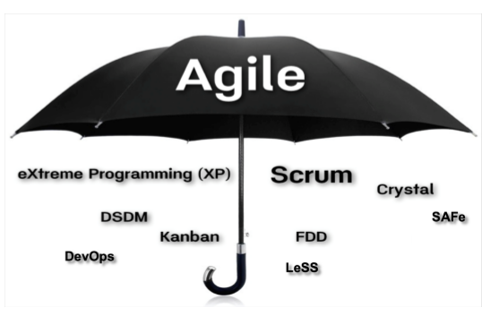

# ”假敏捷“和”真敏捷“--大家都在走向敏捷的路上！

很多团队在从传统开发模式向敏捷开发转型的过程中，都会遇到困惑：那就是现在我们做的算是“真”敏捷吗？

当团队准备向敏捷转型的时候，大家都会先热情高涨的去学习各种敏捷知识，包括前面章节提到的原则、实践和工具等。兴奋的感觉找到了圣杯。但是一旦开始真的实施敏捷后，很快就要面对各种残酷的现实：

- 哪里找到那么好的客户能够经常来互动？
- 说好的持续构建和集成保证质量，怎么一跑测试程序就飞了？
- 每个迭代都回顾，但是技术债务却是越来越多？
- 不是over文档嘛，怎么还要写这么多文档？
- 说好的自组织团队呢，还不是领导说了算！

当在敏捷转型过程中出现各种问题的时候，大家可能会感觉自己参与一个“假敏捷“的项目。

## 所有敏捷项目都是“假敏捷“

首先来看一个经常出现的敏捷的伞图。

敏捷其实是个大杂烩，而且在不断的变化。从敏捷的历史和敏捷宣言的发表就能够看出来。其实是先有的各种实践和流程，后来才汇总成为一个统一的说法”敏捷“。所以敏捷包括的内容很杂，有流程相关的Scrum，有包括各种实践的XP，还有其他各种方法。

之所以说所有敏捷项目都是”假敏捷“，那是因为完美的敏捷本来就是不存在的。看着上面的这个敏捷的伞图，包含了这么多的内容。从来就没有一个项目会把所有的敏捷内容都用上。当然敏捷从来也没有要求尽可能多的去实施所有内容，反而是鼓励循序渐进，持续改进。即使只实施了一部分敏捷实践，也没有哪个项目敢说自己实施的实践都已经做到完美，不需要改进了。

以看板为例。看板是很多敏捷团队都在使用的。但是很多团队只是利用看板的可视化这个特定。看板其实还涉及到并行任务的限制、工作流的优化等，很多敏捷团队可能都用到。但是这并不妨碍看板给很多敏捷团队带来的好处。

所以说在向敏捷转型的过程中，不用纠结于某些原则或实践是否符合理想的敏捷的定义。更关键的是，要不断的持续改进，不断的更加敏捷。

## 所有敏捷项目也都是”真敏捷”

上面刚说了所有敏捷项目都是“假敏捷”，这里怎么又说都是”真敏捷呢“？

很多在实施项目转型的团队最喜欢问的一个问题就是：你觉得我们这样算敏捷吗？

到底什么项目算敏捷呢？这个问题其实也很简单。上面我们看到，从来没有任何一个项目能实现所有敏捷包括的内容的。所以，你所在的项目只要**”部分“**符合敏捷宣言的要求，其实就可以算是敏捷了。

> 个体和互动  高于  流程与工具
>
> 工作的软件  高于  详尽的文档
>
> 客户合作  高于  合同谈判
>
> 响应变化  高于  遵循计划

如果觉得，这个太抽象了。就换成敏捷的12个原则。仍然是只要**部分**，就可以算是敏捷了。

> 1.我们最重要的目标，是通过**持续不断地及早交付有价值**的软件使客户满意。
>
> 2.**欣然面对需求变化**，即使在开发后期也一样。为了客户的竞争优势，敏捷过程掌控变化。
>
> 3.**经常地交付可工作的软件**，相隔几星期或一两个月，倾向于采取较短的周期。
>
> 4.**业务人员和开发人员必须相互合作**，项目中的每一天都不例外。
>
> 5.**激发个体的斗志**，以他们为核心搭建项目。提供所需的环境和支援，辅以信任，从而达成目标。
>
> 6.不论团队内外，传递信息效果最好效率也最高的方式是**面对面的交谈**。
>
> 7.**可工作的软件**是进度的首要度量标准。
>
> 8.敏捷过程倡导**可持续开发**。责任人、开发人员和用户要能够共同维持其步调稳定延续。
>
> 9.**坚持不懈地追求技术卓越和良好设计**，敏捷能力由此增强。
>
> 10.**以简洁为本**，它是极力减少不必要工作量的艺术。
>
> 11.最好的架构、需求和设计出自**自组织团队**。
>
> 12.团队**定期地反思**如何能提高成效，并依此调整自身的举止表现。

如果说原则还是不够落地，那么敏捷中提到的那么多的内容，只要实施了**部分**也可以的。例如：

> Scrum
>
> 看板
>
> 持续集成
>
> 结对开发
>
> 用户故事
>
> 站立会议

上面这一通说明后，你会发现自己肯定是”真敏捷“了。因为在敏捷转型中，你必然或多或少的应用了敏捷中的各种原则和实践。所以说所有敏捷项目其实也都是”真敏捷“。

## ”假敏捷“或”真敏捷“其实不重要，重要的是持续的敏捷

通过上面的介绍，大家应该发现，其实每个敏捷项目都是”真敏捷“，但是每个项目又都不是完美的敏捷。所以讨论”真敏捷“和”假敏捷“本身其实没有任何意义，关键还是在于持续不断的敏捷。已经实施的各种实践，不断的反省是否可以做的更好，同时还要不断的学习新的知识，寻找可以改进团队能力的新的实践。

同时也要看到，敏捷本身也不是一成不变的，她也在不断的演化和发展。所以说，我们每个人都在走向敏捷的路上！大家一起加油吧！